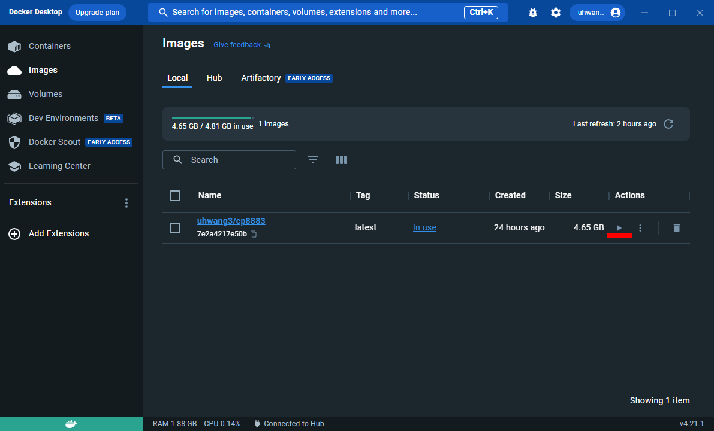

class: inverse, middle

# Intro to R - 1


.font100[
Uijeong "UJ" Hwang

8/18/2025
]

```{r, include=F}
library(xaringanthemer)
library(sf)
library(tidyverse)
library(leaflet)
library(tmap)
library(kableExtra)
```


```{r include=FALSE, warning=FALSE}
nice_table <- function(df, height="150px"){
  return(
    df %>% kable() %>% 
      kable_styling(latex_options="scale_down", font_size=12) %>% 
      scroll_box(width = "100%", height = height)
    )
}
```


```{r, include=F}
library(xaringanthemer)
library(sf)
library(tmap)
library(tidyverse)
library(leaflet)
library(tmap)
library(kableExtra)
```

---
## What is R?
* R is a powerful programming language for statistical computing, data analysis, and graphics.

* R has a rich ecosystem -- 12,000+ packages available in CRAN (Comprehensive R Archive Network).


```{r echo=F, out.width='85%'}

```

---
## Tidyverse
* `tidyverse` is a collection of data science packages that allows you to easily handle/analyze data and visualize/communicate findings.
```{r echo=F, out.width='100%'}

```

---
## sf: spatial data handling and analysis
* sf stands for **Simple features** which refers to a formal standard that describes how objects in the real world can be represented in computers.
* The standard is widely implemented in spatial databases (e.g., PostGIS) as well as commercial GIS (e.g., ArcGIS).
* The package allows you to:
  * read/write/convert spatial data
  * manipulate sf geometries
  * perform spatial operations and analysis

---
## tmap: thematic map
```{r, out.width='100%'}
data("World")

tmap_mode("view")

tm_shape(World) +
  tm_polygons(col = "life_exp")
```


---
## RStudio
* To use R, you need to install R (language) and RStudio (code editor).

```{r echo=F, out.width='90%'}
knitr::include_graphics("https://datacarpentry.org/genomics-r-intro/fig/rstudio_session_4pane_layout.png")
```

---
## Setting up R environment
### Option 1: On your local machine
* Install [R](https://cran.rstudio.com/)
* Install [RStudio](https://posit.co/download/rstudio-desktop/)
* Open RStudio and install `tidyverse`, `sf`, and `tmap`, core packages for this course
  * `install.packages(c('tidyverse', 'sf', 'tmap'))`

### Option 2: Using Docker
* Windows or MacOS with Intel chip only
* You will use a Docker image with all R packages for the class pre-installed

---
## Docker
.small[
* **Docker** is a platform that allows users to build, share, and run containerized environments.

* Why use it?
    * **Consistency**: Everyone gets the same R version and packages.
    * **Isolation**: A Docker container is an isolated environment for your code.
    * **Popularity**: The most-used "other" tool for developers according to [Stack Overflow 2024 survey](https://survey.stackoverflow.co/2024/technology#1-other-tools).
]

```{r echo=FALSE, out.width='70%'}

```


---
## Setting up a Docker container for this course

* Go to [Docker website](https://www.docker.com/), Sign up, and install 'Docker Desktop'.

* Open the Docker Desktop.


---
## Setting up a Docker container for this course
### Pull an image

* Search the image: `uhwang3/cp8883_2024`

* choose the right tag, and pull.
  * Windows/MacOS with Intel chip: `latest`
  * MacOS with M1-3 chips: `multi_platform`


---
## Setting up a Docker container for this course
### Run the image

* Check if you see **uhwang3/cp8883** in Images tab in Docker Desktop

* Click 'Run'(triangle) button.


---
## Setting up a Docker container for this course
### Run the image

.pull-left[
.small[
* Click 'Optional settings' and configure
    * *Container name* can be random
    * Type **8787** in *Host port*
    * Click three dots next to *Host path* and select a local directory to bind
    * Type **/home/rstudio** in *Container path*
    * Type **PASSWORD** in *Environment variable* and choose a password
]
]
.pull-right[

]

---
## Setting up a Docker container for this course
### If you prefer CLI
.small[
* Once Docker is installed, open a terminal.
    * Windows: `Win + R` and run 'cmd'
    * MacOS: `cmd + space` and run 'terminal'

* Run the following command to pull and run an image:
  * **`docker pull uhwang3/cp8883_2024:[tag]`**
  * **`docker run uhwang3/cp8883_2024:[tag] -p 8787:8787 -e PASSWORD=password -v "[your_local_directory]":/home/rstudio`**

* Choose the right tag:
  * Windows/MacOS with Intel chip: `latest`
  * MacOS with M1-3 chips: `multi_platform`
]

---
## How to use the Docker container
* Open a web browser and access **localhost:8787**
    * Username: **rstudio**
    * Password: your own password


---
## How to stop the Docker container
* Click 'Stop' button in Containers tab in Docker Desktop
* You can later rerun the container by clicking 'Start' button


---
exclude: true

## Packages
.mid[
Packages are extensions to R that provide various functions and datasets that the plain R does not have. 
]

###.center[It is like apps for your phone.]

.mid[
**Step 1**: You first need to install a package into your hard drive. Just like installing apps in your phone, you only need to do it once per computer.

**Step 2**: You need to load the package into your R session. This is like opening an app in your phone.

**Step 3**: Now the package is loaded. You can use functions in the package.
]

---
class: inverse, middle, center

# Basics

---
## R as a calculator
I actually use R this way very often.
```{r}
(33 + 43) / 4

exp(2.3) # de-logging natural log

a <- 23 + 21
b <- pi # 3.141593...
a / b
```

---
## Operators

.pull-left[
**Arithmetic operators**
```{r, echo=F}
tribble(
  ~'Operator', ~'Description',
  '+', 'Addition',
  '-', 'Subtraction',
  '*', "Multiplication",
  "/", "Division",
  "^ or **", "Exponentiation",
  "x %% y", "Modulus",
  "x %/% y", "Integer division"
) %>% kable()
```
]

.pull-right[
**Logical operators**
```{r, echo=F}
tribble(
  ~'Operator', ~'Description',
  '<', 'Less than',
  '<=', 'Less than or equal to',
  '==', "Equal to",
  "!=", "Not equal to",
  "!", "Negation (e.g., !x is 'not x')",
  "x | y", "x or y",
  "x & y", "x and y",
  "x %in% y", "x belong to y"
) %>% kable()
```
]


---
## R is case sensitive
* In R, **a** and **A** are not the same. That sounds really simple, but it can really mess up your code and is really hard to find.

* For example, the following code will throw an error. Imagine you are looking for that *capital C* in a script with hundreds of lines of code.

```{r eval=F}
city <- "paris"
City

#> Error: object 'City' not found

```

```{r, include=F}
city <- "paris"
```


Notice that **<-** is the assignment operator. This assigns a name (i.e., `city`) a value (i.e., `"paris"`). 

```{r}
city
```

---
## Naming conventions
* **camelCase**
* PascalCase
* **snake_case**
* kebab-case
* period.case
* flatcase
* Train-Case
* camel_Snake_Case
* Pascal_Snake_Case
* SCREAMING_SNAKE_CASE
* SCREAMING-KEBAB-CASE


---
## Data type and structure
* Data types
  * logical (True, False)
  * character ('a', 'b', 'c', 'abc')
  * numeric (1, 5.5, 10.7)
  * integer (1L, 5L, 10L)

* Data structures

```{r echo=F, out.width='70%'}
knitr::include_graphics("img/data_structures.png")
```

---
## Vector
.footnotesize[
* Vector is a 1-dimensional array that can contain elements of logical, integer, double, complex, character or raw. It can contain only the same data type.
* A vector with 2 or more elements can be created multiple ways. 
* e.g., **c()** concatenates multiple elements of the same type into a vector.

```{r}
a <- seq(1:5)
a

b <- c(1,2,3,4,5)
b
```

```{r eval=F}
c <- c(1, "two", TRUE) # Try this
```
]

---
## Indexing
We use extract operator `[]` to specify which values we'd like to extract or replace.

.footnotesize[
```{r}
# Create a vector
my_vec <- c(5,4,3,2,1)
my_vec

# 2nd element
my_vec[2]
# 1st, 3rd, and 5th elements
my_vec[c(1,3,5)]
# 2nd to 4th elements
my_vec[2:4]
# using conditional statement
my_vec[my_vec>2]
```
]
---
## Indexing
For 2-dimensional data, we have 2 axes or dimension to parse the data.

.center[.red[data][.blue[row index], .green[column index]]]

.small[
```{r}
# Create a matrix
my_matrix <- matrix(c(1,2,3,4,5,6,7,8,9), nrow=3)
my_matrix

# element in 1st row, 2nd column
my_matrix[1,2]
# elements in 1 & 2nd rows, 3rd column
my_matrix[c(1,2), 3]
```
]
---
## Indexing

.center[.red[data][.blue[row index], .green[column index]]]


.scriptsize[
```{r}
# Read data
df_tract <- read.csv("https://raw.githubusercontent.com/ujhwang/urban-analytics-2025/main/Lab/module_0/testdata.csv")
df_tract %>% head() %>% print()

# Subset
df_tract[2,2]

df_tract[1:3, "hhincome"]
```

.scroll-box-12[
```{r}
df_tract[df_tract$hhincome>=100000, ]
```
]
]

---

class: inverse, middle, center

# Application

---
## Setting working directory
### Option 1: Setting it manually
* `setwd()`: setting the working directory
* `getwd()`: checking the working directory

```{r eval=F}
setwd('C:/Users/username/your/own/directory/which/can/be/very/long')
# or
setwd(paste0(Sys.getenv('USERPROFILE'), 
             '/your/own/directory/which/can/be/very/long'))
```

---
## Setting working directory
### Option 2: Setting it automatically (recommended)

* Create an R project by **File -> New Project -> New/Existing Directory**.
* That will create **.Rproj** file in that folder. 
* Your working directory will be set to a folder where the **.Rproj** file is.
* Next time you continue working on the project, double-click the **.Rproj** file.


---
## Setting working directory
### Option 2: Setting it automatically (recommended)

* Let's say you've created an R project folder called CP8883. 
* **Store everything related with CP8883 in that folder.** 
* An example folder structure would look like:

```
CP8883
|--Lab
    |--module_0
    |--module_1
|--Assignment
    |--mini_1
    |--mini_2
        |--assignment.Rmd
|--Data
    |--my_data.csv
|--CP8883.Rproj
```

* Opening **CP8883.Rproj** file will give you a clean R environment. The working directory is where .Rproj file is.


---
## Setting working directory
### Option 2: Setting it automatically (recommended)

* After creating .Rproj and opening R with it, call **library(here)**. 
* **here()** function will let you use relative path across platforms.
* **The relative path should start from where .Rproj is located.**

.pull-left[
```
CP8883
|--Lab
    |--module_0
    |--module_1
|--Assignment
    |--mini_1
    |--mini_2
        |--assignment.Rmd
|--Data
    |--my_data.csv
|--CP8883.Rproj
```
]
.pull-right[
Let's say you are working on **/Assignment/mini_2/assignment.Rmd** and want to read **/Data/my_data.csv**:
```{r eval=F}
# Reading
library(here)
read.csv(here("Data", "my_data.csv"))
```
]

---
## Saving files

R has two native data formats:
* rds: stores a *single* R object
* RData: stores *multiple* R objects

---
## Saving files

### (1) Read/write .rds
* **`write_rds()`, `read_rds()`**: Save and load a single object.

```{r eval=F}
library(tidyverse)
a <- c(1,2,3)

a %>% write_rds(file = 'data/a.rds')
a <- read_rds('data/a.rds')

a %>% write_rds(file = here('data', 'a.rds'))
a <- read_rds(here('data', 'a.rds'))
```

---
## saving files

### (2) Read/write .RData
* **`save()`**: Save multiple objects.
* **`save.image()`**: Save all the objects in the environment.  
* **`load()`**: Load .RData file. Do not use **`<-`** (as .RData file stores the object names as well).

```{r eval=F}
a <- c(1,2,3)
b <- c(3,4,5)

save(a, b, file = 'data.RData') # never use piping for 'save()'
load('data.RData')

save.image(file = 'data_all.RData') # saves everything
load('data_all.RData')
```

---
## Reading data

In urban analytics for planning, the file formats we usually deal with include (but not limited to) **.CSV**, **.SHP**, **.JSON**, and **.GEOJSON**.

We need different packages to import these data formats. 

* CSV: .tiny[https://raw.githubusercontent.com/ujhwang/urban-analytics-2025/main/Lab/module_0/testdata.csv]

* GEOJSON: .tiny[https://raw.githubusercontent.com/ujhwang/urban-analytics-2025/main/Lab/module_0/testdata.geojson]

* JSON: .tiny[https://raw.githubusercontent.com/ujhwang/urban-analytics-2025/main/Lab/module_0/testdata.json]


```{r eval=F}
# CSV files
df <- read.csv("file-name.csv") # or
df <- readr::read_csv("file-name.csv")

# SHP & GEOJSON files
df <- sf::st_read("file-name.shp")
df <- sf::st_read("file-name.geojson")

# JSON files
df <- jsonlite::fromJSON("file-name.json") %>% as.data.frame()
```

---
## dplyr basics
* We just learned indexing using **[ , ]**. 

* We now use what's called **dplyr verbs**.

```{r, message=F}
# Need data first...
df_tract <- read_csv("https://raw.githubusercontent.com/ujhwang/urban-analytics-2025/main/Lab/module_0/testdata.csv")
df_tract %>% nice_table("200px") # ignore this nice_table()
```

---
## dplyr basics

#### select, filter, arrange, mutate, slice, group_by + summarise

All verbs work similarly: <font size=2px, color='grey'>(Wickham & Grolemund (2016))</font>

* The first argument of the verbs is a data frame.
* The subsequent arguments describe what to do with the data frame
* The result is a new data frame.

--

e.g., `filter()` picks observations (i.e., rows of a DF) by their values.

```{r eval=F}
filter(df_tract, # specifies which data.frame
       county == "DeKalb County") # conditional statement
```
which is equivalent to
```{r eval=F}
df_tract[df_tract$county == "Dekalb County", ]
```

---
## BTW, %>% (or |>) is called the **pipe**.
.center[.mid[
It takes whatever is passed from **before** the pipe and 

inserts it as **the first argument** of the following function.
]]

```{r eval=F}
print(head(filter(filter(df_tract, county == 'DeKalb County'), hhincome > 100000), 3))
```

which is equivalent to

```{r}
df_tract %>% 
  filter(county == "DeKalb County") %>% 
  filter(hhincome > 100000) %>% 
  head(3) %>% 
  print()
```

---
## Back to dplyr basics

.pull-left[
* **select()** can pick **variable(s)** by their names.

```{r}
df_tract %>% 
  select(county,race.white) %>% #<<
  nice_table()
```
]

.pull-right[
* **arrange()** can reorder **rows**.
```{r}
df_tract %>% 
  select(county,race.white) %>% 
  arrange(race.white) %>% #<<
  nice_table()
```
]

---
## dplyr basics

**mutate()** can create a new columns using existing columns.
```{r}
df_tract %>% 
  mutate(pct_white = race.white / race.tot) %>% #<<
  select(2:4, race.tot, race.white, pct_white) %>% nice_table()
```

Notice that **select()** can take either variable names or the index of columns.

Because `2:4` in R is the same as `c(2,3,4)`, we select not only race.tot, race.whte, and pct_white, but also the second, third, and fourth columns **of the data table that were passed to select()**.

---
## dplyr basics
**group_by()** creates a grouping across observations (i.e., rows). With the grouping, **summarise()** can do summarization (e.g., taking average) for each group.

In plain English, this code says "Take **df_tract** and calculate the mean of **pct_white** and the median of **hhincome** for each county." It returns a new data table.

```{r}
df_tract %>% 
  group_by(county) %>% # creating grouping by county.  #<<
  summarise(sum_white = sum(race.white), 
            sum_race.tot = sum(race.tot),
            med.hhincome = median(hhincome)) %>% 
  mutate(pct_white = sum_white/sum_race.tot) %>% nice_table("160px") 
```

.mid[.center[**Notice that there are NaN and NA here and there.**]]

---
##  NAs and NaNs
NaN stands for **Not a Number.** This results from numerical operation that outputs undefined results. Try `0/0` in your console.

NA stands for **Not available.** This generally means missing value.

Let's see why we had the problem.


```{r}
df_tract %>% select(-GEOID, -tract, -county, -state) %>% summary() 
```

Notice that **hhincome** has 5 missing values (NAs). <br> **race.tot** has at least one zero.

---
## Dropping NaN and NA
We need to filter out from both race.tot and hhincome using **>**, **&** , **!**, **is.na()**.

Also notice the exclamation mark (**!**) and **is.na()**.

The highlighted part is saying, "pick rows for which race.tot is greater than 0 **AND** hhincome is not NA."

```{r}
df_tract %>% 
  filter(race.tot > 0 & !is.na(hhincome)) %>% #<<
  mutate(pct_white = race.white / race.tot) %>%
  group_by(county) %>% # creating grouping by county.  
  summarise(avg.pct_white = mean(pct_white), # mean for each county
            med.hhincome = median(hhincome)) %>% nice_table("160px")
```

---
[
```{r echo=F}
magick::image_read_pdf("https://www.rstudio.com/wp-content/uploads/2015/02/data-wrangling-cheatsheet.pdf", pages=1)
```
](https://www.rstudio.com/wp-content/uploads/2015/02/data-wrangling-cheatsheet.pdf)

---
# Reading SHP and JSON
Reading SHP and JSON files are no different, except you need some packages. Notice below that we are reading GEOJSON rather than SHP -- they are essentially the same data in different formats (can be slower though).

```{r include=F}
shp <- sf::st_read("https://raw.githubusercontent.com/ujhwang/urban-analytics-2025/main/Lab/module_0/testdata.geojson")
```


```{r message=FALSE, eval=F}
shp <- sf::st_read("https://raw.githubusercontent.com/ujhwang/urban-analytics-2025/main/Lab/module_0/testdata.geojson") 
js <- jsonlite::fromJSON("https://raw.githubusercontent.com/ujhwang/urban-analytics-2025/main/Lab/module_0/testdata.json", flatten = TRUE)
```

```{r}
shp %>% select(GEOID, tract) %>% head() %>% print()
```

---
# 

```{r out.width="100%", out.height="50%"}
library(leaflet)
pal <- colorNumeric(palette = "Reds", domain = shp$hhincome)

leaflet() %>% 
  addProviderTiles(providers$CartoDB.Positron) %>% 
  addPolygons(data = shp, fillColor = ~pal(hhincome), fillOpacity = 0.8, weight = 1, color = "white", 
              popup = paste0("Household Income: ", shp$hhincome)) %>% 
  addLegend(position = "topright", pal = pal, values = shp$hhincome, title = "Annual Household Income", bins = 6)
```

---
# More resources
* [**R for Data Science**](https://r4ds.had.co.nz/): Book written by Hadley Wickham who created the tidyverse.

* **swirl package**: Highly recommend this option if you want to start from the basic
```{r eval=F}
install.packages('swirl')
library(swirl)
swirl()
```

* [**Geocomputation with R**](https://geocompr.robinlovelace.net/): Very good resource to learn geocomputation in sf package. We will heavily use sf package in this class.