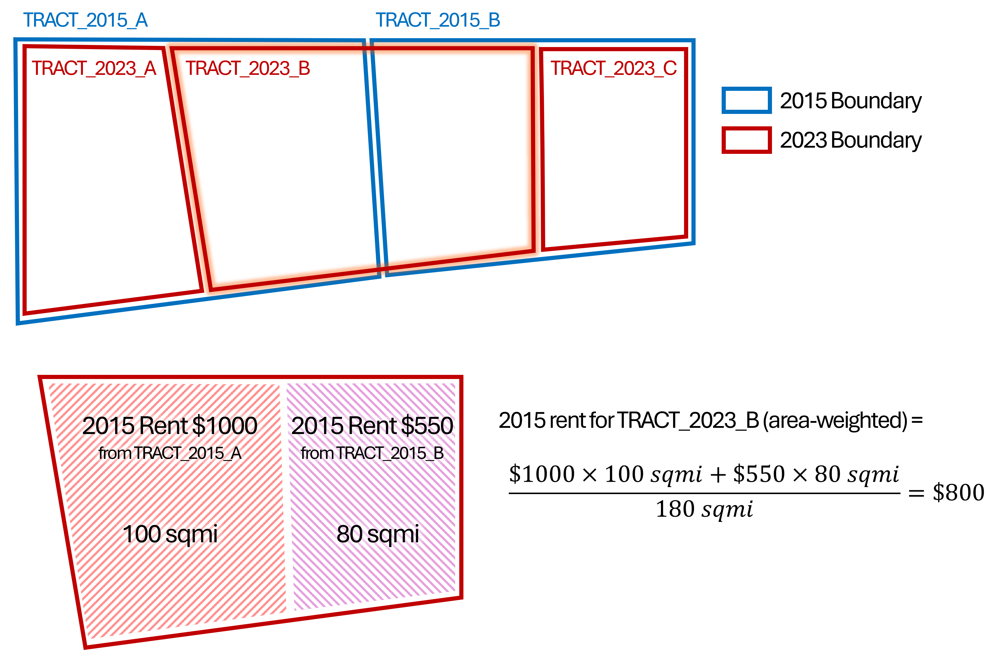

```{r, include=FALSE, message=FALSE}
library(tidycensus)
library(sf)
library(tmap)
library(tidyverse)
library(reshape2)
library(knitr)
library(skimr)
library(units)
library(tigris)
library(magrittr)
ttm()
```

# Yoga Studios and Gentrification

Gentrification is the process of urban transformation in which
neighborhoods undergo socioeconomic changes, typically characterized by
an influx of higher-income residents and investment. This often leads to
increased property values and rents, which can displace lower-income
residents and alter the cultural landscape of the area. While
gentrification can improve infrastructure and amenities, it raises
concerns about social equity, displacement, and the loss of community
identity.

> "Seemingly overnight, a yoga studio replaces a barbershop, a coffee café takes over a small grocery, and a multi-story apartment building looms where older single-family homes once stood." ([Katharine Miller, 2024](https://hai.stanford.edu/news/spotting-visual-signs-gentrification-scale))

In today's lab session, you will be answering this question: ***Are yoga studios associated with gentrification?***

## Operational Definition of Gentrification

Gentrification is about change; the transformation of a neighborhood once affordable becoming unaffordable, so we have two conditions: "*once affordable*" and "*becoming unaffordable*".

To create a simple operational definition, let's say:

* Measure of affordability: Median gross rent for 2-bedroom
* Time period: 2015 - 2023
* "Once affordable": **2-bedroom rent in 2015 was below median value**
* "Becoming unaffordable": **2-bedroom rent in 2023 is above median value** or **the change in rent between 2015 and 2023 is very high**

Then we use the data to define neighborhood type by gentrification status: *Affordable*, *Unaffordable*, and *Gentrifying*

|                            | **Becoming unaffordable**     | **Not becoming unaffordable** |
|----------------------------|:-----------------------------:|:-----------------------------:|
| **Affordable in 2015**     | **Gentrifying**               | Affordable                    |
| **Not affordable in 2015** | Unaffordable                  | Unaffordable                  |


# Data Collection and Manipulation

We need:  

* Census ACS "Median gross rent for 2-bedroom" data for 2015 and 2023 in Fulton and DeKalb Counties
* Yoga studios within the two counties (will be provided)

## Census ACS

### Get ACS data

Let's first download the ACS 5-year estimate data for 2015 and 2023 for the two counties at the Tract level.

```{r, results="hide"}
census_api_key(Sys.getenv(????))

tract_2015 <- suppressMessages(
  get_acs(geography = ????,
          state = "GA",
          county = c("Fulton", "Dekalb"),
          variables = c(median_rent_2br = "B25031_004E"),
          year = ????,
          survey = ????, 
          geometry = ????,
          output = ????)) %>% 
  select(GEOID, median_rent_2br_2015 = median_rent_2br)

tract_2023 <- suppressMessages(
  get_acs(geography = ????,
          state = "GA",
          county = c("Fulton", "Dekalb"),
          variables = c(median_rent_2br = "B25031_004E"),
           year = ????,
          survey = ????, 
          geometry = ????,
          output = ????)) %>% 
  select(GEOID, median_rent_2br_2023 = median_rent_2br)
```

### Visualize the data

Note that `tmap` functions in this document are based on `tmap` v4. If you are using `tmap` v3 (check with `packageVersion("tmap")`), consider upgrading to v4 using `update.packages` or `install.packages`.

```{r, message=F}
atlanta_decatur <- places("GA", progress_bar = F) %>% 
  filter(NAME %in% c("Atlanta","Decatur"))

tm_shape(tract_2015) + tm_fill(fill = "median_rent_2br_2015") +
  tm_shape(atlanta_decatur) + tm_borders(col = "black", lwd = 2)

tm_shape(tract_2023) + tm_fill(fill = "median_rent_2br_2023") + 
  tm_shape(atlanta_decatur) + tm_borders(col = "black", lwd = 2)
```

>Why so many missing values?

### Wait, Boundaries don't match!
Census boundary changes every 10 years, which means 2015 data and 2023 data use different geometries We first need to align these boundaries to enable a direct comparison of rent values over time.

```{r}
print(nrow(tract_2015))
print(nrow(tract_2023))
```

```{r}
tm_shape(tract_2023) + tm_borders(col = "#ebe300", lwd = 5) +
  tm_shape(tract_2015) + tm_borders(col = "#ff5c5c", lwd = 2) +
  tm_view(set_view = c(-84.397671, 33.776624, 13))
```

### Spatial join
To make 2015 ACS tract-level data comparable with 2023 tract boundaries, we will perform a spatial intersection between the two sets of geometries. For each overlap, we will calculate an area-weighted contribution of the 2015 median 2-bedroom rent, so that larger overlaps contribute proportionally more to the final value. After weighting, we will aggregate these contributions to the 2023 tract level, which will give us a dataset where rent values from 2015 and 2023 are directly comparable on the same set of boundaries.

Note: In the code chunk below, `tract_2015 %<>%` is shorthand for `tract_2015 <- tract_2015 %>%`. To use this special pipe, you need to load the `magrittr` package.

```{r}
# Convert CRS from GCS to PCS before spatial operation and fix invalid geometries
tract_2015 %<>% st_transform(32616) %>% st_make_valid()
tract_2023 %<>% st_transform(32616) %>% st_make_valid()

# Spatial intersection join
tract_intersect <- st_intersection(tract_2015 %>% rename(GEOID_2015 = GEOID), 
                                   tract_2023 %>% rename(GEOID_2023 = GEOID))

# Compute area of each overlap and use it as a weight
tract_intersect %<>% 
  mutate(area_overlap = as.numeric(st_area(.)),
         median_rent_2br_2015_weighted = median_rent_2br_2015 * area_overlap)

# Aggregate 2015 rent values to the 2023 tract level
tract_2015_aligned <- tract_intersect %>% 
  group_by(GEOID_2023) %>% 
  summarize(
    median_rent_2br_2015_aligned = 
      (sum(median_rent_2br_2015_weighted, na.rm = TRUE) / sum(area_overlap, na.rm = TRUE)) %>% round(2)
  )

# Join the aligned 2015 rent values back to 2023 tracts
tract <- left_join(tract_2023,
                   tract_2015_aligned %>% 
                     st_drop_geometry() %>% 
                     select(GEOID = GEOID_2023, median_rent_2br_2015 = median_rent_2br_2015_aligned), 
                   by = "GEOID")
```

The following figure illustrates what we just did.


### Get changes in median gross rent for 2-bedroom

Calculate the change of median gross rent for 2-bedroom between 2015 and 2023. Then, remove Tracts with missing values or anomalies.
```{r}
tract %<>% 
  mutate(
    median_rent_2br_change = (median_rent_2br_2023 - median_rent_2br_2015)/median_rent_2br_2015
    ) %>% 
  drop_na(median_rent_2br_change) %>% 
  filter(median_rent_2br_2015 > 300 & median_rent_2br_change < 3)
```

### Summarize and visualize the data
```{r}
print(paste0("Median value of median 2-bedroom rent in 2015: $", 
             median(tract$median_rent_2br_2015) %>% round(2)))

print(paste0("Median value of median 2-bedroom rent in 2023: $", 
             median(tract$median_rent_2br_2023) %>% round(2)))

print(paste0("Median change of the median 2-bedroom rent between 2015 and 2023: ", 
             median(tract$median_rent_2br_change*100) %>% round(1), "%"))

hist(tract$median_rent_2br_change, breaks = 50)
abline(v = mean(tract$median_rent_2br_change), col = "red", lwd = 3)

tm_shape(tract) + tm_fill(fill = "median_rent_2br_change", 
                          fill.scale = tm_scale(values = "magma")) + 
  tm_shape(atlanta_decatur) + tm_borders(col = "#00ace0", lwd = 2) +
  tm_view(set_view = c(-84.397671, 33.776624, 11))
```
>Do these numbers, the plot, and the map make sense to you?

### Neighborhood type by gentrification status

Classify Census Tracts into the three categories we defined. Review the `case_when()` documentation to understand how the function evaluates conditions and returns the corresponding values sequentially.
```{r}
tract %<>% 
  mutate(gentri_category = case_when(
    median_rent_2br_2015 >= median(median_rent_2br_2015) ~ "Unaffordable",
    median_rent_2br_2023 >= median(median_rent_2br_2023) | median_rent_2br_change >= 1 ~ "Gentrifying",
    TRUE ~ "Affordable"))
```

How many Tracts are gentrifying between 2015 and 2023?
```{r}
table(tract$gentri_category)
```

### Let's see which neighborhoods are gentrifying.
```{r, message=FALSE}
tm_shape(tract) + tm_fill(col = "gentri_category", palette = c("lightblue", "red", "pink")) + 
  tm_shape(atlanta_decatur) + tm_borders(col = "black", lwd = 2) +
  tm_view(set.view = c(-84.397671, 33.776624, 11))

tm_basemap("OpenStreetMap") +
  tm_shape(tract %>% filter(gentri_category == "Gentrifying")) + tm_borders(col = "red", lwd = 4) + 
  tm_shape(atlanta_decatur) + tm_borders(col = "black", lwd = 2) +
  tm_view(set.view = c(-84.397671, 33.776624, 11))

```


## Yoga Studio POIs

### Load the POI data

**We will use the Google Places POI data that has already been downloaded for today's class.**

This data covers Fulton and DeKalb Counties, GA, and includes all Google Places entries with the place type `"yoga_studio"`.

```{r}
yoga <- st_read("https://raw.githubusercontent.com/ujhwang/urban-analytics-2025/main/Lab/module_2/week1/yoga_studios_fulton_dekalb.geojson")
```

Remove POIs without any review rating.
```{r}
yoga %<>% ????
```

### Let's see if the results look fine

Get a summary using `skimr::skim()` and display the locations of yoga studios on the Census Tract map.

```{r, warning=F}
skim(yoga)

tm_shape(yoga) + tm_dots(fill="red") + 
  tm_shape(tract) + tm_borders() +
  tm_shape(atlanta_decatur) + tm_borders(col = "black", lwd = 2)
```

### Join the yoga studio data to Census Tract data

We aim to determine the presence of yoga studios at the Census Tract level. To achieve this, we will:

1. Spatial join the two datasets.
2. Get a vector of GEOIDs for all Census Tracts that have at least one yoga studio (many tracts will have none).
3. Use these GEOIDs to create a boolean column indicating whether a yoga studio is present in each Tract.


```{r, warning=F}
## Make sure the CRS of the two sf objects are in the same PCS
tract %<>% st_transform(????)
yoga %<>% st_transform(????)

# Join yoga studios with tracts
tract_yoga <- st_join(????, ????)

# Get the presence of yoga studios at the tract level
geoid_tracts_with_yoga <- tract_yoga %>% 
  filter(!is.na(name)) %>% 
  pull(GEOID) %>% 
  unique()

# Join the presence of yoga studios to `tract`
tract %<>% mutate(yoga = GEOID %in% ????)
```

### Confirm the spatial join was done correctly

Visually check that the spatial join worked as intended by plotting the presence of yoga studios and overlaying the original yoga studio locations.

```{r}
tm_shape(????) + tm_fill(fill=????) +
  tm_shape(????) + tm_dots()
```

# Exploring the Association

## Now we are ready to ask some probing questions about the data

Are yoga studios in **gentrifying neighborhoods**?

```{r}
tm_shape(tract) + tm_fill(fill=????) +
  tm_shape(yoga) +tm_dots()
```

> It appears that most yoga studios are located in “unaffordable” neighborhoods.

Let's see the proportion of Census Tracts with at least yoga studio by neighborhood type.

```{r}
yoga_summary <- tract %>% 
  st_drop_geometry() %>% 
  group_by(yoga, gentri_category) %>% 
  summarize(n = n()) %>% 
  ungroup() %>% 
  mutate(proportion = n / sum(n))

yoga_summary %>% 
  ggplot(aes(x = gentri_category, y = proportion, fill = yoga)) +
  geom_bar(stat = 'identity', position = 'fill')
```

> Gentrifying neighborhoods have more yoga studios than affordable neighborhoods, but less than already unaffordable neighborhoods.

## Regression model

### Model specification

* Model type: Binomial logistic regression
* Dependent variable: **Presence of yoga studios**
* Independent variable: **Neighborhood type by gentrification status**
* Control variables:
  * **Educational attainment** (Rationale: higher education levels may correlate with interest in wellness activities such as yoga.)
  * **Median household income** (Rationale: income levels can influence the affordability and demand for amenities like yoga studios.)
  * **Median age** (Rationale: Age demographics may affect lifestyle preferences and demand for fitness-related amenities.)
  * **Non-family household** (Rationale: neighborhoods with higher shares of single or non-family households may have greater demand for lifestyle-oriented amenities, including yoga studios.)
  * **Racial/ethnic composition** (Rationale: the demographic makeup of a community might correlate with cultural or lifestyle preferences that influence yoga studio presence.)
  * **Population who commute by walking/biking** (Rationale: pedestrian/cyclist-friendly areas may be more likely to have yoga studios)
  * **Population density** (Rationale: denser areas provide a larger customer base and foot traffic, increasing the likelihood of yoga studios opening and sustaining operations.)

### Collect data for the control variables

```{r}
tract_control_vars <- suppressMessages(
  get_acs(geography = ????,
          state = ????,
          county = ????,
          variables = c(pop = "B01003_001E",
                        edu_associate = "B06009_004E",
                        edu_bachelor = "B06009_005E",
                        edu_graduate = "B06009_006E",
                        edu_total = "B06009_001E",
                        hhincome = "B19013_001E",
                        median_age = "B01002_001E",
                        nonfamily_hh = "B11001_007E",
                        hh = "B11001_001E",
                        non_hispanic_white = "B03002_003E",
                        race_ethnic_total = "B03002_001E",
                        commute_walk = "B08006_015E",
                        commute_bike = "B08006_014E",
                        commute_total = "B08006_001E"),
          year = 2023,
          survey = ????, 
          geometry = TRUE,
          output = ????)) %>% 
  mutate(high_edu_pct = (edu_associate + edu_bachelor + edu_graduate)/edu_total,
         minority_pct = (race_ethnic_total - non_hispanic_white)/race_ethnic_total,
         commute_walk_pct = commute_walk/commute_total,
         commute_bike_pct = commute_bike/commute_total,
         nonfamily_hh_pct = nonfamily_hh/hh)

# Calculate land area of Census Tract and get population density using the area
tract_control_vars %<>% 
  mutate(area = st_area(.) %>% set_units(mi^2)) %>%
  mutate(pop_density = pop/area)

# Remove unnecessary columns including geometry
tract_control_vars %<>% 
  select(GEOID, high_edu_pct, hhincome, median_age, minority_pct, 
         commute_walk_pct, commute_bike_pct, pop_density, nonfamily_hh_pct) %>% 
  st_drop_geometry()

# Join the control variables to the original Tract data
model_data <- tract %>% left_join(tract_control_vars, by = ????)
```

### Run the model

Since our dependent variable is the presence of yoga studio (TRUE/FALSE), Let's run a binomial logistic regression model using `glm()`.

```{r}
m1 <- glm(yoga ~ gentri_category + high_edu_pct + hhincome + median_age + nonfamily_hh_pct + 
            minority_pct + commute_walk_pct + commute_bike_pct + pop_density, 
          data=model_data, family = "binomial")

????(m1)
```


> How would you interpret this result?

### So what do you think about our initial question? ***Are yoga studios associated with gentrification?***

### Would the result be different if we use ***median real estate tax*** instead of median rent? Or what if we use the **proximity** to yoga studio instead of the presence?
