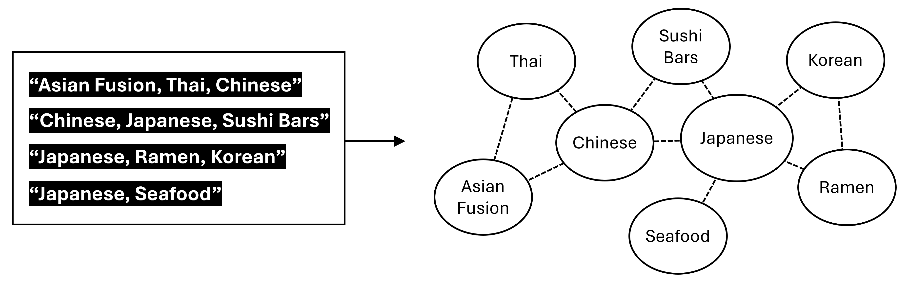

# Why visualization?

Data visualization is an essential tool in urban analytics. It provides an intuitive and quick way to understand the characteristics and relationships within your data. A well-designed visualization can sometimes communicate a message more effectively than any other medium, even shaping how people perceive information. And, of course, visually appealing charts are just… cool.

The first thing analysts do when they receive a dataset is try to understand it. One of the most effective ways to do this is through visualization. We have a wide variety of maps and charts to choose from, including scatter plots, histograms, box plots, violin plots, and thematic maps.

```{r, message=FALSE, results='hide', warning=FALSE}
library(tidyverse)
library(sf)
library(tmap)
library(leaflet)
library(tidycensus)
library(magrittr)
```

```{r, results='hide', message=FALSE, warning=FALSE}
# Let's prepare data
restaurants <- read_rds("https://raw.githubusercontent.com/ujhwang/urban-analytics-2025/main/Lab/module_2/week2/yelp_restaurants.rds")

# Census data
census_var <- c(hhincome = 'B19019_001E',
                race.total = "B02001_001E",
                race.white = "B02001_002E", 
                race.black = 'B02001_003E'
                )

census <- get_acs(geography = "tract", state = "GA", county = c("Fulton", "DeKalb"),
                 output = "wide", geometry = TRUE, year = 2023,
                 variables = census_var)
  
summarise_mean <- c(names(census_var), 
                    "rating", "review_count")

census_restaurants <- census %>% 
  separate(col = NAME, into=c("tract","county","state"), sep='; ') %>% 
  # Spatial join
  st_join(restaurants %>% 
            mutate(n = 1,
                   price = nchar(price)) %>% 
            st_transform(crs = st_crs(census))) %>% 
  # Group_by
  group_by(GEOID, county) %>% 
  # Mean for all census variables, sum for n
  summarise(across(
    all_of(summarise_mean), mean), 
    n = sum(n),
    price = median(price)) %>% 
  # Release grouping
  ungroup() %>% 
  # Replace NA in column n&review_count with 0
  mutate(across(c(n, review_count), function(x) case_when(is.na(x) ~ 0, TRUE ~ x)))
```

Let's first visualize the data on a map. So far, we have mostly used `tmap`, but the `leaflet` package is also an excellent option for interactive mapping with greater customizability.

```{r warning=F}
library(leaflet)
library(htmlwidgets)
library(htmltools)

# CSS for title
tag.map.title <- tags$style(HTML("
  .leaflet-control.map_title { 
    position: absolute;
    left: 50px;
    width: 320px;
    text-align: left;
    color: white;
    padding-left: 10px; 
    background: rgba(200,200,200,0.2);
    font-weight: bold;
    font-size: 20px;
    font-family: Helvetica;
    border-color: white;
    border-radius: 10px;
  }"))

# Format title
title <- tags$div(
  class="map_title", tag.map.title, HTML("<p>Restaurants in Fulton and DeKalb Counties</p>")
)  

# Color palette
fill_pal <- colorQuantile(palette = "YlOrRd", domain=restaurants$review_count)

# Label for mouseover & popup
labels <- paste(
  "<a href=",restaurants$url,">",restaurants$name, "</a><br>",
  "<strong>Review Count: </strong>", restaurants$review_count,"<br>",
  "<strong>Rating: </strong>", restaurants$rating) %>%
  lapply(HTML)

# Creating a Leaflet widget
leaflet() %>% 
  # Setting the view on load
  setView(lng = -84.3903996350635, lat = 33.77074368998939, zoom = 11) %>% 
  
  # Dark base map
  addProviderTiles(providers$CartoDB.DarkMatterNoLabels) %>% 
  
  # Polygon boundary
  addPolygons(data = census %>% st_union(), 
              opacity=0.2,
              fillOpacity=0,
              weight=1,
              color="white") %>% 
  
  # Restaurant point
  addCircleMarkers(data = restaurants, 
             radius = restaurants$rating*1.5, 
             opacity=0.2,
             fillColor=~fill_pal(review_count),
             weight=1,
             color= ~fill_pal(review_count),
             popup= ~labels,
             label= ~labels) %>% 
  
  # Legend
  addLegend("bottomright", pal = fill_pal, values = restaurants$review_count,
            title = "Review Count",opacity = 1) %>% 
  
  # Title
  addControl(title, position="topleft",className="map_title")
```

<br><br> For static maps, the `ggplot2` is another great choice. See [this example](https://timogrossenbacher.ch/bivariate-maps-with-ggplot2-and-sf) for inspiration.

```{r}
library(ggspatial)
library(prettymapr)

ggplot(data = restaurants) +
  annotation_map_tile(type = "cartolight") +
  geom_point(mapping = aes(color = log(review_count+1), 
                           x = st_coordinates(restaurants)[,1], 
                           y = st_coordinates(restaurants)[,2]), 
             size=2, alpha=0.9) +
  theme_void() +
  scale_color_gradientn(colours = c("darkblue", "purple", "gold")) +
  labs(title = "Restaurant Distribution in Fulton & DeKalb Counties, GA")

```

# Scatter plot

In `tmap` package, two functions always go hand-in-hand, namely `tm_shape()` and `tm_polygons()` (or `tm_borders`, `tm_lines`, `tm_dots`, etc.). The `tm_shape()` function declares the data object to be displayed. Then, the `tm_polygons()` function defines the geometry shape and other associated characteristics.

A similar structure is used in the `ggplot2` package. Creating a plot needs at least two functions that are connected by `+`: `ggplot()` function and `geom_point()` (or other geometry types, such as `geom_line`, `geom_boxplot`, etc.). In the example below, `ggplot(data = census_restaurants)` indicates that we are drawing ggplot using `census_restaurants` data. Then, `geom_point(aes(x = review_count, y = rating))` shows that we are going to draw a scatter plot using `review_count` and `rating` columns.

```{r warning=F}
ggplot(data = ????) +
  geom_point(mapping = aes(x = ????, y = ????))
```

## Aesthetic mappings

We can add additional information to this plot using a few different strategies, including colors, sizes, and shapes inside the `aes()` -- 'Aesthetic mappings' which describe how variables in the data are mapped to visual properties (aesthetics) of geoms. For example, we can add `price` information using color.

```{r warning=F}
ggplot(data = ????) +
  geom_point(mapping = aes(x=????, y=????, 
                           color=????)) + #👈
  scale_color_gradient(low = "darkblue", high = "red")
```

Or size.

```{r warning=F}
ggplot(data = ????) +
  geom_point(mapping = aes(x=????, y=????, 
                          size=????)) #👈
```

Or transparency.

```{r warning=F}
fig1 <- ggplot(data = ????) +
  geom_point(mapping = aes(x=????, y=????, 
                           alpha=price)) #👈

fig2 <- ggplot(data = ????) +
  geom_point(mapping = aes(x=????, y=????, 
                           alpha=price, #👈
                           size=price)) #👈

gridExtra::grid.arrange(????, ????, ncol= 1)
```

If you put, for example, color and size arguments outside of `aes()`, the visual property from those arguments are not based on your data.

```{r warning=F}
fig2 <- ggplot(data = census_restaurants) +
  geom_point(mapping = aes(x=review_count, y=rating), 
             color = "orange") #👈

fig3 <- ggplot(data = census_restaurants) +
  geom_point(mapping = aes(x=review_count, y=rating), 
             size = 5) #👈

gridExtra::grid.arrange(fig2, fig3, ncol = 1)
```

## Separating plots by categorical values

Use `facet_wrap` with a categorical variable. Remember that if you use `facet_wrap` with a continuous data, it will generate as many plots as the unique values in the continuous data. Avoid writing such codes!

```{r warning=F}
ggplot(data = census_restaurants) +
  geom_point(mapping = aes(x=review_count, y=rating)) +
  facet_wrap(~county) #👈
```

```{r warning=F}
ggplot(data = census_restaurants) +
  geom_point(mapping = aes(x=review_count, y=rating)) +
  facet_grid(???? ~ ????) #👈
# One will be rows; the other will be columns.
# try swapping the two
```

## Regression line

You can draw a regression line by using `geom_smooth` with the "lm" method.

```{r warning=F}
ggplot(data = census_restaurants) +
  geom_????(mapping = aes(x=review_count, y=rating), method = ????)
```

More informative if you show both data points and the regression line.

```{r warning=F}
# More than one layers
ggplot(data = census_restaurants) +
  geom_point(mapping = aes(x=review_count, y=rating)) + 
  geom_????(mapping = aes(x=review_count, y=rating), method = ????)
```

In the code above, we are repeating `aes(x=review_count, y=rating)` twice. If we know that mapping will be the same in multiple layers, we can define it in `ggplot()`.

```{r warning=F}
# You don't need to repeat `mapping = aes(x=review_count, y=rating)` twice
ggplot(data = census_restaurants, mapping = aes(x=review_count, y=rating)) + #👈
  geom_point() + 
  geom_????(method = ????)
```

If you want to add a specific mapping to a layer, you provide additional mapping to individual layers.

```{r warning=F}
ggplot(data = census_restaurants, mapping = aes(x=review_count, y=rating)) +
  geom_point() + 
  geom_????(mapping = aes(color = ????), #👈
            method = ????)
```

You can append `labs()` to specify labels.

```{r warning=F}
ggplot(data = census_restaurants, 
       ???? = aes(x=review_count, y=rating)) +
  geom_point() + 
  geom_????(???? = aes(color = ????), method = ????) +
  labs(x = "Review Count", #👈
       y = "Rating",
       color = "County in Census",
       title = "Do better rated restaurants have more reviews?")
```

# Aesthetic options

## Theme

We can change how the plot looks using `theme_<...>`.

```{r warning=F}
ggplot(data = census_restaurants) +
  geom_point(mapping = aes(x=review_count, y=rating, color = county)) + 
  labs(x = "Review Count",
       y = "Rating",
       color = "County in Census",
       title = "Do better rated restaurants have more reviews?") +
  theme_bw()
```

Using a dark theme can make it easier on the eyes.

```{r warning=F}
ggplot(data = census_restaurants) +
  geom_point(mapping = aes(x=review_count, y=rating, color = county)) + 
  labs(x = "Review Count",
       y = "Rating",
       color = "County in Census",
       title = "Do better rated restaurants have more reviews?") +
  ggdark::dark_theme_gray()
  
```

## Custom color scheme

If you want to use your custom color choices - for a discrete variable.

```{r warning=F}
ggplot(data = census_restaurants) +
  geom_point(mapping = aes(x=review_count, y=rating, color = county)) + 
  labs(x = "Review Count",
       y = "Rating",
       color = "County in Census",
       title = "Do better rated restaurants have more reviews?") +
  scale_color_manual(values = c("green", "darkblue")) + #👈
  theme_bw()
```

If you want to use your custom color choices - for a continuous variable.

```{r warning=F}
ggplot(data = census_restaurants) +
  geom_point(mapping = aes(x=review_count, y=rating, color = hhincome)) + 
  labs(x = "Review Count",
       y = "Rating",
       color = "Annual Household Income",
       title = "Do better rated restaurants have more reviews?") +
  scale_color_gradient(low="darkblue", high="red") + #👈
  theme_bw()
```

## Data labeling

Let's label some of the outliers using `ggrepel`.

```{r warning=F}
outliers <- census_restaurants %>% 
  arrange(desc(review_count)) %>% 
  slice(1:4)

ggplot(data = census_restaurants,
       aes(x=review_count, y=rating)) + # moved aes() to here
  geom_point(mapping = aes(color = ????)) + # Colored ones
  geom_point(data = outliers, size = 3, shape = 1, color = "black") + # Black circles
  ggrepel::geom_label_repel(data = census_restaurants, mapping = aes(label = ????)) + 
  labs(x = "Review Count",
       y = "Rating",
       color = "Annual Household Income",
       title = "Do better rated restaurants have more reviews?") +
  scale_color_gradient(low="darkblue", high="red") + #👈
  theme_light()
```

## Interactive visualization

How can we convert these plots into interactive ones? The simplest way is to use `ggplotly()` in `plotly` package.

```{r warning=F}
p <- ggplot(data = census_restaurants) +
  geom_point(mapping = aes(x=review_count, y=rating, color = hhincome)) + 
  labs(x = "Review Count",
       y = "Rating",
       color = "Annual Household Income",
       title = "Do better rated restaurants have more reviews?") +
  scale_color_gradient(low="darkblue", high="red") + #👈
  theme_bw()

plotly::????(p)
```

## 3D scatter plot

Using `plot_ly` in `plotly` package, we can also create a 3-dimensional scatter plot. It is particularly useful when you want to examine associations between four variables.

```{r}
plotly::????(census_restaurants %>% st_drop_geometry(),
                x = ~hhincome,
                y = ~n,
                z = ~rating,
                color = ~price,
                type = "scatter3d",
                mode = "markers",
                text = ~paste0("Avg. price: ", round(price, 2)),
                hoverinfo = "text")
```

# Bar plot

Bar plot is also very commonly used. Note that `ggplot2` automatically creates the y-axis by counting the number of rows for each category of `x`. You can try `restaurants %>% group_by(price) %>% tally()` to check the exact Y-values for this plot.

```{r}
ggplot(data = restaurants) +
  geom_bar(mapping = aes(x=price)) 

restaurants %>% 
  st_set_geometry(NULL) %>% 
  group_by(price) %>% 
  tally()
```

We can also further break each price level by another categorical variable. We use rating to see the relative frequency of each rating for each price level. This is done by adding `fill=rating` in the mapping.

```{r eval=F}
ggplot(data = restaurants %>% 
         st_set_geometry(NULL) %>% 
         mutate(rating = round(rating,0) %>% #👈
                  factor(ordered = TRUE))) + #👈
         # delete %>% factor(ordered = T) and see what happens
  geom_bar(mapping = ???(x=????, fill=rating), position = "stack")
```

By changing `position="stack"` to `position="fill"`, we convert the Y-axis to the proportion within each level of price and fill it up to the top. This shows more clearly how different rating levels are distributed within each price level.

```{r}
ggplot(data = restaurants %>% 
         st_set_geometry(NULL) %>% 
         mutate(rating = round(rating,0) %>% 
                  factor(ordered = TRUE))) +
  geom_bar(mapping = ????(x=????, fill=rating), position = ????) #👈
```

We want rating=5 to be on the top because it is more intuitive to see higher value on top. We can flip the bar plot vertically by adjusting the `levels` when we declare `rating` variable into a factor.

```{r}
ggplot(data = restaurants %>% 
         st_set_geometry(NULL) %>% 
         mutate(rating = round(rating,0) %>% 
                  factor(levels = c(5,4,3,2,1), #👈
                         ordered = TRUE))) +
  geom_bar(mapping = ????(x=????, fill=rating), position = ????)
```

Sometimes, we want to see the exact numbers on top of a bar plot. Let’s add the percentage for each price level as labels.

```{r}
ggplot(data = restaurants %>% 
         st_set_geometry(NULL) %>% 
         mutate(rating = round(rating,0) %>% factor(levels = c(5,4,3,2,1), ordered = TRUE))) +
  geom_bar(???? = aes(x=????, fill=rating), position = ????) +
  geom_text(data = . %>% 
              # Grouping to calculate % by price and by rating 
              group_by(price, rating) %>% #👈
              # Count rows
              tally() %>%                 #👈 
              # Convert to p
              mutate(p = n / sum(n)) %>%  #👈
              # Re-order to match the order in bar plot
              arrange(desc(rating)),      #👈
            aes(x = price, y = p, label = str_c(round(p,3)*100,"%")), color = "white",
            position = position_stack(vjust=0.5)) +
  ggdark::dark_theme_gray() # Dark theme because texts are not visible against white bg
```

You can rotate it.

```{r}
ggplot(data = restaurants %>% 
         st_set_geometry(NULL) %>% 
         mutate(rating = round(rating,0) %>% factor(levels = c(5,4,3,2,1), ordered = TRUE))) +
  geom_bar(???? = aes(x=????, fill=rating), position = ????) +
  geom_text(data = . %>% 
              # Grouping to calculate % by price and by rating 
              group_by(price, rating) %>%
              # Count rows
              tally() %>%
              # Convert to p
              mutate(p = n / sum(n)) %>%
              # Re-order to match the order in bar plot
              arrange(desc(rating)),
            aes(x = price, y = p, label = str_c(round(p,3)*100,"%")), color = "white",
            position = position_stack(vjust=0.5)) +
  coord_flip() + #👈
  ggdark::dark_theme_gray() # Dark theme because texts are not visible against white bg
```

## Customization example (Optional)

I saw this beautiful [example](https://www.cedricscherer.com/2021/07/05/a-quick-how-to-on-labelling-bar-graphs-in-ggplot2/) by CÉDRIC SCHERER and applied it to our data.

```{r}
# Code & ideas borrowed heavily from CÉDRIC SCHERER's personal website: 
# https://www.cedricscherer.com/2021/07/05/a-quick-how-to-on-labelling-bar-graphs-in-ggplot2/

max_city_n <- 10

rest_by_city <- restaurants %>% 
  st_set_geometry(NULL) %>% 
  group_by(location.city) %>% 
  tally() %>% 
  arrange(desc(n)) %>% 
  slice(1:max_city_n) %>% 
  mutate(location.city = factor(location.city, levels = .$location.city[seq(max_city_n,1)])) %>% 
  # Format text label
  mutate(pct = scales::percent(n / sum(n),accuracy = 0.1),
         pct = case_when(row_number() == 1 ~ str_c(pct, " of all businesses"), TRUE ~ pct)) %>% 
  # Define aesthetic properties - label location
  mutate(nudge = case_when(row_number()==1 ~ 1.05, TRUE ~ -0.2)) %>% 
  # Define aesthetic properties - color
  mutate(color = case_when(row_number()==1 ~ "gray30", TRUE ~ "gray70")) %>% 
  # Color palette
  mutate(pal = c(rep('gray70', max_city_n-4), "coral2", "mediumpurple1", "mediumpurple1", "goldenrod1")) %>% 
  # with() is required to be able to call variables with referencing to data frame
  with(
    # ggplot
    ggplot(data = .) +
      # Bars
      geom_col(mapping = aes(y = location.city, x = n, fill = location.city)) +
      # Text
      geom_text(mapping = aes(y = location.city, x = n, label = pct), 
                # Calling aesthetic properties defined above
                hjust=nudge, color=color, 
                # Font styling
                fontface="bold.italic") + 
      # Stretch x axis
      scale_x_continuous(limits = c(NA, 2200)) +
      # Custom palette
      scale_fill_manual(values = pal, guide="none") +
      # Labels
      labs(x = "Count", y = "Cities", title = "Top 10 cities with most restaurants in Fulton & DeKalb Counties\n") +
      # Dark theme
      ggdark::dark_theme_classic()
  )

rest_by_city
```

# Histogram, box plot, & violin plot

## Histogram

A histogram displays the distribution of a variable. It first assigns observations (i.e., rows) of the given variable (i.e., a column) into bins (e.g., 0–99, 100–199, 200–299, etc.) and counts the number of observations in each bin. The taller a bar, the more observations fall into that bin.

For example, in the histogram below, the first bar that touches 0 is much taller than the others because most observations had zero or near-zero reviews.

Let's examine the distribution of review counts using a histogram. 

>Observe what changes in each plot.

```{r}
ggplot(census_restaurants) +
  geom_histogram(mapping = ????(x = ????))
```

```{r}
ggplot(census_restaurants) +
  geom_histogram(mapping = ????(x = ????), 
                 bins = 60) #👈 increase the number of bins from 30 to 50. You get more bars.
```

```{r}
ggplot(census_restaurants) +
  geom_histogram(mapping = ????(x = ????), 
                 bins = 60,
                 color="black")  #👈 color of the outline
```

```{r}
ggplot(census_restaurants) +
  geom_histogram(mapping = ????(x = ????), 
                 bins = 60,
                 color="black") +
  scale_x_continuous(breaks=seq(0,1300, by=100)) #👈
```

```{r}
ggplot( census_restaurants) +
  geom_histogram(mapping = ????(x = ????, fill=county), #👈
                 bins = 60,
                 color="black",
                 position = "identity", #👈
                 alpha = 0.2) #👈
  scale_x_continuous(breaks=seq(0,1300, by=100))
```

```{r}
ggplot(census_restaurants) +
  geom_histogram(mapping = ????(x = ????, fill=county), 
                 bins = 60,
                 color="black",
                 position = "dodge") + #👈
  scale_x_continuous(breaks=seq(0,1300, by=100))
```

```{r}
ggplot(census_restaurants) +
  geom_histogram(mapping = ????(x = ????, fill=county), 
                 bins = 60,
                 color="black",
                 position = "dodge") + 
  scale_x_continuous(breaks=seq(0,1300, by=100)) + 
  scale_fill_manual(values=c("#999999", "#E69F00")) #👈
```

## 2D histogram

If you want to examine the distribution of two continuous variables simultaneously, a 2D histogram (or bivariate binning plot) is a good choice. It divides the plot area into bins and counts the number of points in each bin, with colors representing the number of observations.

```{r, warning=F}
ggplot(census_restaurants) +
  geom_bin2d(mapping = aes(x = review_count, y=rating))
```

## Box plot

Although the histogram allows us to effectively see the distribution, comparing **multiple distributions** are often easier with a box plot. You need to understand what each component of a box plot means to read it properly. `plotly::ggplotly()` provides a good interactive visualization about how to read the plot. Note that upper fence = Q3 + (1.5\*IQR), where IQR is interquartile range (Q3-Q1). The lower fence is Q1 - (1.5\*IQR).

```{r}
bxplot <- ggplot(data = restaurants) +
  geom_boxplot(aes(x=price, y=review_count),
               color="black",fill="white")

plotly::????(bxplot)
```

```{r}
a <- ggplot(data = restaurants) +
  geom_boxplot(aes(x=price, y=review_count), 
               fill = "white", color = "black")

b <- ggplot(data = restaurants) +
  geom_boxplot(aes(x=review_count, y=price), 
               fill="white", color="black") 

gridExtra::grid.arrange(a, b)
```

You can use `scale_fill_manual()` to use your custom color. To do this, however, you need to have specified `fill` inside `aes()`. If it is not specified at all or is specified outside of `aes()`, custom color won't work.

```{r}
restaurants %>%
  st_join(census %>% st_transform(crs = st_crs(restaurants))) %>% 
  separate(col = NAME, into=c("tract","county","state"),sep="; ") %>% 
  drop_na(county) %>% 
  ggplot() +
  geom_boxplot(aes(x = price, y=review_count, fill = price), 
               color = "black") +
  facet_wrap(~county) +
  scale_fill_brewer(palette = "Blues")
```

## Violin plot

Violin plot is yet another plot for visualizing the distribution of variables. While a box plot allows you to see where the upper/lower fences are and where the median and quartiles are, a violin plot allows you to see the concentration of observations at a certain bins (or range if you will) of values.

```{r}
vplot <- ggplot(data = restaurants %>%
                  st_join(census %>% st_transform(crs = st_crs(restaurants))) %>% 
                  separate(col = NAME, into=c("tract","county","state"),sep="; ") %>% 
                  drop_na(county)) +
  geom_violin(aes(x = price, y=review_count, fill = price), 
               color = "black") +
  facet_wrap(~county) +
  scale_fill_brewer(palette = "Blues")

plotly::ggplotly(vplot)
```

# Network visualization
Another interesting type of visualization we can do in R is a network graph. Network graphs are particularly useful for exploring **connections and co-occurrences** in data, which can be difficult to see in traditional plots or maps.

Suppose we are interested in examining how restaurant categories are related. Often, POIs are not classified into a single type but into multiple categories, such as:

```{r}
print(restaurants$categories[restaurants$name == "Tin Drum"][1])
```

Using this information, we create a network graph that represents associations between categories across the entire dataset. This visualization can reveal related groups of categories, popular combinations, and overall patterns in restaurant offerings.



We can create interactive network visualizations using packages like `networkD3`. This package is built on top of `D3.js`, a powerful JavaScript library that provides the underlying rendering engine and interactivity in web browsers.

To do this, we first transform our data into nodes and edges:  

* **Nodes** represent unique categories.
* **Edges** represent co-occurrences of categories in the same observation.

## Edges & nodes

If the following code chunk looks complicated, don’t worry--you don’t need to understand every detail to follow along.

```{r}
library(utils)

# Split comma-separated strings into a list of character vectors
categories_list <- str_split(restaurants$categories, ", ")

# Create an edge list
edges <- categories_list %>% 
  map_dfr(function(x) {
    if(length(x) > 1) as.data.frame(t(combn(x, 2))) else NULL}
  )
colnames(edges) <- c("source", "target")

# Clean edges (undirected, unique)
edges %<>% 
  rowwise() %>%
  mutate(source = min(c(source, target)),
         target = max(c(source, target))) %>%
  ungroup() %>%
  distinct() %>% 
  filter(source != target)

# Get nodes and their frequencies
nodes <- unlist(categories_list)
node_freq <- as.data.frame(table(nodes))
colnames(node_freq) <- c("name", "freq")

# Numeric node ID for networkD3
nodes <- node_freq %>% mutate(id = 0:(n() - 1))

# Replace names with node IDs
edges %<>%
  mutate(source = match(source, nodes$name) - 1,
         target = match(target, nodes$name) - 1)
```

## Force-directed graph

Once the nodes and edges are defined, we can render an interactive force-directed graph, where node size can reflect frequency and edges show relationships between categories.

```{r, out.width="100%", out.height="900px", message=F, warning=F}
fn <- networkD3::forceNetwork(
  Links = edges, Nodes = nodes,
  Source = "source", Target = "target",
  NodeID = "name",
  Group = "name",
  Nodesize = "freq",
  fontFamily = "Verdana",
  opacity = 0.9,
  zoom = TRUE,
  fontSize = 20,
  linkDistance = 200,
  linkWidth = 0.3,
  linkColour = "#888",
  charge = -10
)

# Make it look nicer: set background to black and labels to white
fn %>% 
  htmlwidgets::onRender(
    JS("function(el, x) {
      d3.select(el).select('svg').style('background-color', 'black');
      d3.select(el).selectAll('.node text').style('fill', 'white');
    }")
)
```


# So, do restaurants in wealthy neighborhoods get higher ratings?

>What do you think?

```{r warning=F}
census_restaurants %>% 
  mutate(
    review_count_cut = cut(review_count, 
                           breaks = quantile(review_count, 
                                             prob = c(0,0.5,0.75,1)), 
                           include.lowest=TRUE)
  ) %>%
  ggplot(data = ., aes(x = ????, y = ????)) +
  geom_point(mapping = aes(color = review_count_cut)) +
  geom_smooth(method = ????, color = "lightblue") +
  scale_color_manual(values = c("gray50", "orange", "red"), 
                     labels = c("0 - 50th", "50th- 75th", "75th - 100th")) +
  labs(x = "Annual Household Income", 
       y = "POI Rating", 
       color = "Review Count (discrete)", 
       title = "Household Income vs. Rating") +
  ggdark::dark_theme_gray() +
  
  # ------------------------------------------------------------------
  # This line of code adds the correlation analysis result to the plot
  ggpubr::stat_cor(method = "pearson", label.x = 160000, label.y = 2)
```

As we've seen, data visualization is an indispensable tool for urban analysts. If we have some time left in class, consider socioeconomic or demographic variables from the American Community Survey that might be associated with POI review count, rating, or price. Then, gather the data, create plots, and draw insights from your findings.
