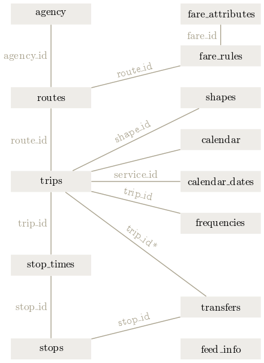

```{r message=FALSE, warning=FALSE, echo=FALSE}
# Import required packages
library(tidytransit)
library(tidyverse)
library(tmap)
library(ggplot2)
library(here)
library(units)
library(sf)
library(leaflet)
library(tidycensus)
library(plotly)
library(tidygraph)
library(leafsync)
library(here)
```

```{=html}
<style type="text/css">
  body{
  font-family: Arial;
  }
</style>
```

# What is the General Transit Feed Specification (GTFS)?

| The GTFS is a common format for public transit schedules and associated geographic information provided by transit agencies.

Before GTFS, there wasn't a standardized format for transit timetables and other associated information ([source](https://en.wikipedia.org/wiki/GTFS)). Users of transit data across multiple transit agencies had to deal with different data formats. With GTFS, feeds from different agencies became standardized (although not perfect), making applications of the data easy.

Useful Links:

-   [tidytransit (i.e., R package) Vignettes](https://cran.r-project.org/web/packages/tidytransit/index.html)
-   [gtfs.org](https://gtfs.org)
-   [Google Transit](https://developers.google.com/transit/gtfs/reference)
-   [Mobility Database](https://mobilitydatabase.org)
-   [transitland](https://www.transit.land/)
-   [TransitFeeds (sunsetting)](https://transitfeeds.com/)

Let's download GTFS feed provided by Metropolitan Atlanta Rapid Transit Authority (MARTA).

```{r, results='hide'}
gtfs <- read_gtfs("https://www.itsmarta.com/google_transit_feed/google_transit.zip")
```

<br>

GTFS consists of multiple tables and comes in a zip file as a single package. Transit is a complex system that contains multiple components (e.g., routes, stops, service schedules) working together. The table below shows a brief description of what each data.frame contains. This table is taken from [Google](https://developers.google.com/transit/gtfs/reference).

**Table 1. Description of tables in GTFS feed**

| Table name      | Defines                                                                                                                                                         |
|:------------|:----------------------------------------------------------|
| agency          | (Required) Transit agencies with service represented in this dataset.                                                                                           |
| stops           | (Required) Stops where vehicles pick up or drop off riders. Also defines stations and station entrances.                                                        |
| routes          | (Required) Transit routes. A route is a group of trips that are displayed to riders as a single service.                                                        |
| trips           | (Required) Trips for each route. A trip is a sequence of two or more stops that occur during a specific time period.                                            |
| stop_times      | (Required) Times that a vehicle arrives at and departs from stops for each trip.                                                                                |
| calendar        | Service dates specified using a weekly schedule with start and end dates. This file is required unless all dates of service are defined in calendar_dates.txt.  |
| calendar_dates  | Exceptions for the services defined in the calendar.txt. If calendar.txt is omitted, then calendar_dates.txt is required and must contain all dates of service. |
| fare_attributes | Fare information for a transit agency's routes.                                                                                                                 |
| fare_rules      | Rules to apply fares for itineraries.                                                                                                                           |
| shapes          | Rules for mapping vehicle travel paths, sometimes referred to as route alignments.                                                                              |
| frequencies     | Headway (time between trips) for headway-based service or a compressed representation of fixed-schedule service.                                                |
| transfer        | Rules for making connections at transfer points between routes.                                                                                                 |
| pathways        | Pathways linking together locations within stations.                                                                                                            |
| levels          | Levels within stations.                                                                                                                                         |
| feed_into       | Dataset metadata, including publisher, version, and expiration information.                                                                                     |
| translations    | Translated information of a transit agency.                                                                                                                     |
| attributions    | Specifies the attributions that are applied to the dataset.                                                                                                     |

These tables are *relational table* that are connected through a system of join keys. The schematic below shows which tables are linked to which tables, through which join keys. Understanding this structure is essential in using GTFS.



Figure 1. GTFS relational table structure IMAGE SOURCE: <http://tidytransit.r-transit.org/articles/introduction.html>

For joining datasets, we've been primarily using `left_join()` so far, but `tidyverse` offers various join functions, including left_join(), right_join(), inner_join(), full_join().


Consider the table below. While the number of rows are the same for df.x and df.y, only three names (i.e., Andrew, Olivia, and Emily) are on both tables. `full_join(x, y)` returns all rows and all columns from both x and y. Where there are not matching values, returns NA for the one missing. `left_join(x, y)` returns all rows from x, and all columns from x and y. Rows in x with no match in y will have NA values in the new columns. If there are multiple matches between x and y, all combinations of the matches are returned. `right_join(x, y)` return all rows from y, and all columns from x and y. Rows in y with no match in x will have NA values in the new columns. If there are multiple matches between x and y, all combinations of the matches are returned. `inner_join(x, y)` returns all rows from x where there are matching values in y, and all columns from x and y.


  
  
# Handling GTFS data in R

## What's inside `gtfs` object

Now, let's take a look at the `gtfs` object in which we read the GTFA feed from MARTA. This object is a list. In it, `names(gtfs)` shows that there are `r length(gtfs)` data.frames. Notice that there are many tables displayed in Table 1 above, but only some of them are in `gtfs`. Notice in Table 1 that only some are required; others are optional.

```{r}
typeof(gtfs)
names(gtfs)
print(head(gtfs))
```

<br>

## Converting GTFS Into Geospatial Format

The function `gtfs_as_sf` converts **shapes** and **stops** tables in GTFS data into sf objects. In the print out below, you will notice that all other tables have not changed, but 'shapes' and 'stops' tables are now **Simple feature collection** and have added column 'geometry' that contains a series of coordinates. Under the hood, `gtfs_as_sf` is no special function; this function uses `st_as_sf()` to do the conversion, the same way we have been doing so far in this class.

Even though we have 9 tables but only 2 of them are in sf format, that's fine. We can still figure out other tables' spatial properties because we can **join** the non-sf tables to **shapes** and/or **stops**. We can join other tables to 'shapes' and 'stops' table using **join keys**.

```{r}
# Converting GTFS data into sf objects
gtfs_sf <- tidytransit::gtfs_as_sf(gtfs, crs = 4326)
gtfs_sf$stops %>% head() # Notice that this is POINT
gtfs_sf$shapes %>% head() # This is LINESTRING
```

Let's take a look at their maps of their routes and stops, respectively. These maps (route shapes on the left; stop locations on the right) show the coverage of MARTA.

Notice that I am using **leaflet()** for mapping instead of **tmap()**. Of course, you can make the same map with tmap package as well; I am using **leaflet()** in this module just to expose you to different packages. As you follow along this R Markdown, feel free to make these maps in whichever package you prefer to use. **Through this course, you can use whatever package you like to use for interactive mapping and visualization; it won't affect your grade in any way.**

```{r}
# Visualize
a <- leaflet(gtfs_sf$shapes) %>% # add data to display
  addProviderTiles(providers$CartoDB.DarkMatter) %>% # add BaseMap
  addPolylines(weight = 1, color = "red") %>% # add lines
  addControl(htmltools::HTML("Route shapes")) # add Title 

b <- leaflet(gtfs_sf$stops) %>% # add data to display
  addProviderTiles(providers$CartoDB.DarkMatter) %>% # add BaseMap
  addCircles(weight = 3, color = "red") %>% # add circles
  addControl(htmltools::HTML("Stop shapes")) # add Title 

leafsync::sync(a,b)
```

     
<br><br>
  
# Calculating Transit Service Quality

There are many different types of analyses that can be done using GTFS data. In this class, we will focus on the equity aspect of transit services. While numerous studies on transit service equity use much more sophisticated methods (e.g., [this paper](https://www.sciencedirect.com/science/article/pii/S0966692317303794?casa_token=u5ystJxKU8sAAAAA:EW3L6ZODX0eq0yVXYl-FWcphYRzcbyD71KEVu9uRWL8PxaL79ebuNKS12KDB_tyfeRrtcbhWuQ)), this course will introduce simpler yet intuitive approaches to evaluate this issue.

 

One of the simplest ways to assess transit service quality is to examine the portions of each neighborhood that lie within a certain distance from transit stops or routes.

In this section, we will

1.  Extract transit lines (and stops) for rail and bus
2.  Draw buffers around them
3.  Intersect the buffer with Census Tracts
4.  Calculate the proportion of each Census Tract that are within the buffers

## Step 1: Extracting lines

GTFS from MARTA contains information about various transit types, including rails and buses. The `routes` table in `gtfs` has a column named `route_type`, which contains integer values denoting types of transit service (e.g., bus vs. rail transit).


`routes` table contains route_types, which is needed for separating rail transit from bus transit. `shapes` table contains the geographic information needed for geospatial operations such as buffer, intersections, etc. Because `routes` and `shapes` table do not contain a common key, they need to be joined through `trips` table as an intermediate table.

Notice that there can be multiple trips that runs on the same routes. If we join `trips` and `routes`, one rows in `routes` table will be matched with multiple rows in `trips` table and create duplicated.

```{r}
# Join routes table with trips table with shapes table
trip_routes <- gtfs$trips %>% 
  full_join(gtfs$routes, by = "route_id")

trip_shape <- gtfs_sf$shapes %>% 
  full_join(gtfs$trips %>% 
              select(shape_id, trip_id), 
            by = "shape_id")

# Merging the two into one and then taking only one row for each
# unique combination of route_id and shape_id.
route_trip_shape <- trip_shape %>% 
  select(-shape_id) %>% 
  full_join(trip_routes, by = c("trip_id")) %>% 
  group_by(shape_id, route_id) %>% 
  slice(1)

# Route type is not really intuitive - let's fix that
route.shape <- route_trip_shape %>% 
  mutate(route_type = case_when(
    route_type == "0" ~ 'Tram, Streetcar',
    route_type == "1" ~ 'Subway, Metro',
    route_type == "2" ~ 'Rail',
    route_type == "3" ~ 'Bus'
  ))
```

```{r}
pal <- leaflet::colorFactor(c("red", "orange", "pink"), domain = route.shape$route_type)

route.shape %>% 
  leaflet::leaflet(data = .) %>% 
    leaflet::addProviderTiles(providers$CartoDB.DarkMatter) %>% 
    leaflet::addPolylines(color = ~pal(route_type), 
                 weight = 3,
                 opacity = 0.9,
                 popup = paste0("Route type: ", route.shape$route_type))
  
```
```{r}
table(route.shape$route_type)
```

## Step 2: Drawing buffers

We can use **st_buffer()** function from sf package to draw buffers from the transit routes. To be more precise, we would need to draw buffers around each stop, as people cannot just hop on bus or train between stations. For this class, however, we will simplify the process by drawing buffers around the line geometry given the fact that bus stations are so closely located to one another and their 400 meter (or a quarter mile, which is a commonly used distance for walking) buffer would be almost the same as buffer around the line.

Drawing buffers is a simple process, but it's important to be aware of the coordinate system of your spatial data when you do spatial operations with sf. Until Version 0.9.8, the sf package used 'equirectangular projection' via GEOS library for many operations that involve, for example, `st_intersects`, `st_intersection`, `st_union`, `st_nearest_point`, `st_join`, etc. What this means is that sf package carried out these operations assuming that the Earth is a flat surface. It did so even when the given data is in geographical coordinate system (GCS). From Version 1.0 onwards (since 2021), sf switched to using S2 spherical geometry developed by Google for spatial operations. This change allows for more accurate calculations on a global scale when working with geographic coordinates. For most local-scale analyses, the difference introduced in Version 1.0 is unlikely to have significant impacts. However, you may notice some minor differences in results compared to earlier versions.

It's worth noting that while this change improves accuracy for global-scale analyses, there are still scenarios where converting from GCS to a projected coordinate system (PCS) can be beneficial:
  
  * When performing distance-based operations (like creating buffers) in a specific local area, using an appropriate PCS can provide more accurate results in terms of real-world distances.
  * If you need to ensure exact compatibility with results from older versions of sf or other GIS software that use planar geometry, using a PCS might be preferable.
  
In the following code chunk, we transform `route.shape` from GCS to PCS. This transformation is not strictly necessary due to the sf package's improved handling of geographic coordinates, but it can be helpful for certain types of analyses or visualizations. If we were to use the original GCS (crs = 4326) for buffer creation, you might notice that the resulting buffer polygons have slightly rough outlines with minor zig-zag patterns. This is a result of the S2 geometry's handling of geographic coordinates and is generally not a cause for concern in most analyses. For more information on what all of these means, you can read [this post](https://r-spatial.org/r/2020/06/17/s2.html#sf-10-goodbye-flat-earth-welcome-s2-spherical-geometry).

```{r}
# Buffering LINESTRING ---------------------------------------
sf::sf_use_s2(TRUE) # This is default to TRUE when we load SF package. So this code is not really needed. I added it here just to make it more explicit.
MARTA_buffer <- route.shape %>% 
  sf::st_transform(crs = ????) %>% # PCS / WGS 84 / UTM zone 16N
  sf::st_buffer(dist = units::set_units(????, "m")) # a quarter mile

# To union the buffer polygons by route_type
MARTA_buffer_group <- MARTA_buffer %>% 
  group_by(route_type) %>% 
  summarise()

# Buffering POINTS ---------------------------------------
# Just to show that lines & points overlap well
MARTA_stop_buffer <- gtfs_sf$stops %>% 
  st_transform(crs = ????) %>%  # PCS / WGS 84 / UTM zone 16N
  st_buffer(dist = units::set_units(????, "m")) %>% # a quarter mile
  st_union()
```

```{r}
pal <- colorFactor(palette = c("red", "yellow", "blue"), domain = MARTA_buffer_group$route_type)

leaflet() %>% 
  addProviderTiles(providers$CartoDB.DarkMatter) %>% 
  
  addPolygons(data = MARTA_buffer_group %>% st_transform(crs = 4326), col = ~pal(route_type),
              popup = MARTA_buffer_group$route_type,
              group = "Buffer from Line") %>%
  
  addPolygons(data = MARTA_stop_buffer %>% st_transform(crs = 4326),
              weight = 0.5, 
              color = "white",
              group = "Buffer from Point") %>% 
  addLayersControl(
    overlayGroups = c("Buffer from Line", "Buffer from Point"),
    options = layersControlOptions(collapsed = FALSE)
  )
```

## Step 3: Intersect the buffer with Census Tracts

We will use `tidycensus` package again to download Census data at Tract-level.

```{r message=FALSE, warning=FALSE, results='hide'}
# Get American Community Survey
acs2023 <- tidycensus::get_acs(geography = "tract",
                   variables = c("hhinc" = ????, # median household income
                                 "total_hh" = ????, # household total
                                 "no_car_hh" = ????), # household without car
                   year = 2023,
                   output = "wide",
                   state = "GA",
                   county = c("Fulton", "DeKalb", "Clayton"),
                   geometry = TRUE) 
```

In the following code, I use **st_area()** to calculate the area of the polygon for later use. Note that I **unclass()** the output from **st_area()** because **st_area()** does not return plain numeric values; the output is of 'units' class. This is to provide not only the area value in numeric but also the unit in which the area is measured in. While this is useful, having something other than plain numeric values may cause some complications later. So I *drop* the class 'unit', which converts it into numeric values.

```{r, out.width="100%"}
# Cleaning Census data
acs2023 <- acs2023 %>% 
  mutate(pct_no_car = no_car_hh/total_hh) %>% 
  # Calculate area of the Census Tract polygons
  mutate(area = st_area(.) %>% unclass) %>% 
  select(GEOID, hhinc, pct_no_car, area) %>% 
  filter(!is.na(hhinc))


pal1 <- colorNumeric(palette = "YlOrRd", domain = acs2023$hhinc)
pal2 <- colorFactor("Spectral", domain = MARTA_buffer_group$route_type)

# Mapping
leaflet() %>% 
  addProviderTiles(providers$CartoDB.DarkMatter) %>% 
  addPolygons(group = "ACS",
              data = acs2023, 
              color = "grey", 
              fillColor = ~pal1(hhinc), 
              fillOpacity = 0.5,
              weight = 1, 
              popup = leafpop::popupTable(round(st_drop_geometry(acs2023[,c("hhinc", "pct_no_car")]),2))) %>% 
  addPolygons(group = "MARTA",
              data = MARTA_buffer_group %>% 
                st_transform(crs = st_crs(acs2023)), 
              color = ~pal2(route_type),
              weight = 1,
              opacity = 0.9) %>% 
  addLayersControl(
    overlayGroups = c("ACS", "MARTA"),
    options = layersControlOptions(collapsed = FALSE)
  )
```

Then we merge the Census data and the buffers from the GTFS. This requires **st_intersection()**, not st_join(), because we want to 'cut' the Census polygons by the shape of GTFS buffers so that we will be able to calculate the area of the intersection.

**Notice that the output from st_intersection()** can be different from the input. While **st_join** returns the same geometry as the input data (although the same geometry can be duplicated), **st_intersection()** directly edits the geometry (see the image below).

```{r, echo=FALSE}
knitr::include_graphics("http://postgis.net/workshops/postgis-intro/_images/intersection.jpg")
```

```{r}
# Intersect buffer with tract 
buffer_intersect_tract <- acs2023 %>% 
  # Unify the CRS
  st_transform(crs = st_crs(MARTA_buffer_group)) %>% 
  # Intersection
  st_intersection(MARTA_buffer_group) %>% 
  # Extract bus routes only
  filter(route_type == ????)
```

```{r}
# Visualize
pal_buf <- colorFactor(palette = "Spectral", domain = buffer_intersect_tract$route_type)

leaflet() %>% 
  addProviderTiles(providers$CartoDB.DarkMatter) %>% 
  addPolygons(data = acs2023 %>% st_transform(crs = 4326), fillOpacity = 0.2, color = "white", weight = 0.5, group = 'Census') %>% 
  addPolygons(data = MARTA_buffer_group %>% st_transform(crs = 4326), fillOpacity = 0.2, color = "yellow", weight  = 0.5, group = 'GTFS') %>% 
  addPolygons(data = buffer_intersect_tract %>% st_transform(crs = 4326), group = "Intersection",
              fillColor = ~pal_buf(route_type), fillOpacity = 0.9, weight = 1, opacity = 0.3, color = "grey") %>%     # leaflet takes 4326
  addLayersControl(overlayGroups = c("Census", "GTFS", "Intersection"), options = layersControlOptions(collapsed = FALSE))

```

## Step 4. Calculate the proportion of each Census Tract that are within the buffers.

Finally, we need to calculate the proportion of each Census Tract that overlaps with the GTFS buffers. We will need to know the (1) total area of Census Tracts, which we calculated above and (2) the area of the intersected polygons. We will then divide the intersected polygons' area by the total area and put that into a column named `pct_served`.

```{r}
# Intersected area
buffer_intersect_tract <- buffer_intersect_tract %>% 
  mutate(subarea = unclass(st_area(.)),
         pct_served = subarea/area) %>% 
  # Back to GCS
  st_transform(crs = 4326)

# Joining the intersected information back to the original Census Data.
# This is needed because we may have lost a few polygons during intersection.
buffer_by_tract <- acs2023 %>% 
  # In left_join(A, B), B must be non-sf object.
  left_join(buffer_intersect_tract %>% 
              select(GEOID, pct_served) %>% 
              st_set_geometry(NULL),
            by = "GEOID") %>% 
  # There are many NAs in the pct_served column because there are many Census Tracts
  # that do not overlap with the GTFS buffer. They would have NA in pct_served column.
  # This code converts the NAs into 0.
  mutate(pct_served = case_when(is.na(pct_served) ~ 0,
                                 TRUE ~ pct_served))

# Map
pal_serv <- colorNumeric(palette = "Spectral", domain = buffer_by_tract$pct_served, reverse = TRUE)

leaflet() %>% 
  addProviderTiles(providers$CartoDB.DarkMatter) %>% 
  addPolygons(data = buffer_by_tract, 
              fillColor = ~pal_serv(pct_served), fillOpacity = 0.9, 
              color = "white", opacity = 0.2, 
              weight = 1) %>% 
  addLegend("bottomright",
            pal = pal_serv,
            values = buffer_by_tract$pct_served,
            title = "% Area within 400m from transit line") 
```

# Statistical testing for equity implications

Now that the data is ready, we can use various methods to examine whether transit service area is ***equitably distributed***.


Earlier we got **household income** and **household without vehicle (%)** from Census ACS. The two variables will be used to see if the transit service is equitably distributed. The two variables are strong indicators of socioeconomic status and highly correlated with each other. Lower-income households without vehicle rely more heavily on public transit, so using the two variables will help identify areas where affordable transit is most needed.

We will 1) draw scatter plots and 2) perform a correlation analysis to evaluate the equity. Let's first draw scatter plots to visualize the relationship between % service area and various socioeconomic/demographic variables. These variables are by no means complete; feel free to test other variables that represent population characteristics that you are interested in.

## Scatter plots
Here we will draw multiple scatter plots by using **facet_wrap()** in `ggplot2` package. To use this function, ggplot requires that the input data is in a long-form where one column shows the variable name and the another column shows the value. ggplot draws multiple scatter plots by grouping the rows by variable names. Also notice the labeller; we provide formatted titles for each variable name so that the plots get proper titles.

Looking at the scatter plots below, the two variables appear to have some associations with % service area. The visual inspection is very intuitive and powerful, but it is limited in telling us how strong the relationships are and how confident we can be that there exist these relationships.

```{r}
# Readable plot title  
var_name <- c(
  'hhinc'="Annual Household Income",
  'pct_no_car'="% Household without vehicle"
)

var_name_labeller <-  as_labeller(var_name)

buffer_by_tract %>% 
  #filter(na_index) %>% 
  pivot_longer(cols = c('hhinc', 'pct_no_car'), names_to = "variable", values_to = "value") %>% 
  ggplot(aes(x = pct_served, y = value)) +
  facet_wrap(~variable, scales = "free_y", labeller = var_name_labeller, ncol = 2) +
  geom_point(alpha = 0.4) +
  geom_smooth(method = "lm", se = FALSE, color="red") +
  labs(x = "\n % Area with 400m beffer from transit line") +
  theme_bw()
```

## Correlation analysis
Correlation analysis can provide how strong the relationship between two variables is and how much confidence we can have about that knowledge. R has built-in function **cor.test()** that runs correlation analysis. It takes two vectors (i.e., variables) as input and outputs various statistics such as correlation coefficients, degrees of freedom, and t- and p-values.

Notice that the code below shows two different syntax to perform the same task. Feel free to use whichever syntax you like.

```{r}
## Correlation analysis
# Syntax 1: not using pipe
cor.test(buffer_by_tract$pct_served, 
         buffer_by_tract$hhinc)

# Syntax 2: using pipe and 'with'
buffer_by_tract %>%
  with(cor.test(pct_served, hhinc))
```
```{r}
buffer_by_tract %>%
  with(cor.test(pct_served, pct_no_car))
```
Both *household income* and *household without vehicle (%)* show a significant correlation with *area served by transit service (%)*: *Household income* is negative and *household without vehicle (%)* is positive. These correlations suggest that:

  * Areas with more extensive public transit coverage tend to have lower household incomes. This could indicate that transit systems prioritize serving lower-income areas, or that higher-income households prefer areas with less transit coverage.
  * Areas with better public transit service tend to have more households without vehicles. This implies that good public transit might reduce the need for car ownership, or that transit planners focus on areas where more people lack personal vehicles.

In a nutshell, public transit system in Atlanta may be playing a role in providing transportation equity by better serving areas where the need is greater.


# Using stops + their frequency differences

Using the geometry of transit routes may be a less accurate measure for transit service quality, because some stops have more frequent services than others. We can calculate how many departures occur at each stop during a given time period.

Here, we are going to focus on the morning commute time (7AM to 10 AM) and count the number of departures at each stops. The `tidytransit` package provides convenient functions that makes this analysis a breeze.

```{r}
service_ids <- gtfs$calendar %>% pull(service_id)
stop_freq <- get_stop_frequency(gtfs, 
                                start_time = 7*3600, # input unit is in second. So 7*3600 is 7AM 
                                end_time = 10*3600, 
                                service_ids = service_ids, 
                                by_route = T) 
stop_freq_sf <- gtfs_sf$stops %>% 
  left_join(stop_freq, by="stop_id") %>% 
  filter(!is.na(n_departures))

freq_pal <- colorNumeric("Reds", stop_freq_sf$n_departures)

leaflet() %>% 
  addProviderTiles(providers$CartoDB.DarkMatter) %>% 
  addCircles(data = stop_freq_sf,
             fillColor = freq_pal(stop_freq_sf$n_departures),
             fillOpacity = 0.8,
             weight = 10,
             stroke = FALSE,
             popup = str_c(stop_freq_sf$stop_name, ": ", stop_freq_sf$n_departures)) %>% 
  addLegend(position = "bottomright",
            pal = freq_pal,
            values = stop_freq_sf$n_departures,
            title = "Count of Departures <br> between 7AM and 10AM")
```

## Merge frequency by stop information with ACS data

We use spatial join to merge GTFS service frequency data to Census.

```{r}
stop_tract <- acs2023 %>% 
  st_transform(crs = 4326) %>% 
  st_join(stop_freq_sf) %>% 
  group_by(GEOID) %>% 
  summarise(avg_n_departures = mean(n_departures, na.rm = T),
            sum_n_departures = sum(n_departures, na.rm = T),
            hhinc = mean(hhinc, na.rm = T),
            pct_no_car = mean(pct_no_car, na.rm = T))

knitr::kable(head(stop_tract))
```

```{r}
sum_n_depart <- colorQuantile(palette = "Reds", domain = stop_tract$sum_n_departures)

sum_depart_map <- leaflet() %>% 
  addProviderTiles(providers$CartoDB.DarkMatter) %>% 
  addPolygons(data = stop_tract, 
              fillColor = sum_n_depart(stop_tract$sum_n_departures),
              fillOpacity = 0.8,
              color = 'grey',
              weight = 1, 
              popup = paste0("ID: ", stop_tract$GEOID, ", Value: ",
                             stop_tract$sum_n_departures)) %>% 
  addLegend(position = "bottomright",
            values = stop_tract$sum_n_departures,
            pal = sum_n_depart)

sum_depart_map

message(str_c("there are ", sum(is.na(stop_tract$sum_n_departures)), " NAs in n_departures"))
```

```{r fig.align="center", out.width="100%", fig.height=10}
# Is there any correlation between SES and service area?
stop_tract_plot <- stop_tract %>% 
  mutate(hhinc = log(hhinc),
         pct_no_car = log(pct_no_car + 0.05),
         n_departure_log = log(sum_n_departures + 1)) %>% 
  pivot_longer(cols = c('hhinc', 'pct_no_car'), 
               names_to = "variable", values_to = "value") %>%
  mutate(variable = factor(variable, 
                           labels = c('Household Income', "% No car")))

departure_count <- stop_tract_plot %>% 
  ggplot(aes(x = n_departure_log, y = value)) +
  geom_point(alpha = 0.2) +
  geom_smooth(method = "lm") +
  facet_wrap(~variable, scales = "free_y") +
  labs(x = "Count of departures between 7AM and 10AM", title = "Departure Count VS. Socio-demographics") +
  theme_bw() 
```

```{r}
plotly::ggplotly(departure_count)
```
Does it look different from the previous scatter plot?

  
# Calculate travel times from one station to all other stations 

The tidytransit package offers a very convenient function that calculates the shortest travel times from a stop to all other stops. Try `?tidytransit::travel_times` to see what this function does and what arguments it takes. Notice that only two out of nine arguments are required arguments, and the rest are optional. The required arguments are 'filtered_stop_times' and 'stop_name.' If you do not provide the optional arguments, the function will use the pre-populated values for the calculation.

**But if you run the function right away, there will be an error.** The error is caused by the fact that there are stations that share names but are far from each other. There may be more than one stations in different parts of the city that share their names, which sometimes actually happen in real world. If duplicate names in our dataset is caused by these legitimate cases, the duplicate names should not be considered as errors. However, if in reality there are no such stations, the duplicate names would be actual flaws in your data.

The `travel_times()` function calculates travel time based on station names. This function is designed to throw an error if there are stops with the same name **regardless** of whether the duplicate names are legitimate reflection of the real world or flaws in the data. One exceptional case when duplicated names don't cause error is when the stations with duplicate names are within 300 meters from each other -- in this case, the function considers the two stations may actually be the same station and merges them.

For all other cases (duplicate names that are 200-meters apart), we need to modify the duplicate names so that the names are actually different. We do that through the following steps:

1.  For each unique station names in **stops** table, calculate how many duplicates there are and, if there are duplicates, calculate distances to the duplicate stops. `stop_group_distances()` function can do this.
2.  Get names of the stops that have duplicates far from each other. If stops with duplicate names are close (e.g., within 200 meters), they may actually be same stations.
3.  For all stops with duplicates \> 200-meter distances, change their station names by appending (1), (2), ... (n) where n is the number of duplicates. For example, if there are two "MIDTOWN STATION"s, they will each be "MIDTOWN STATION (1)" and "MIDTOWN STATION (2)".
4.  One of the requirements for `travel_times()` function is that `gtfs` object contains a **transfer** table. However, the transfer table is an optional table in GTFS definition. Some entities include transfer table by default, some don't. MARTA is among those who don't include transfer table. We can use `gtfs_transfer_table()` function from gtfsrouter package to ***create*** this table and include it to the `gtfs` object.
5.  Finally, one of the two required arguments, 'filtered_stop_times', takes an output from a function called `tidytransit::filter_stop_times()`. This function takes two required arguments: (1) our `gtfs` object and (2) a date for which we'd like calculate travel time. You can also choose to specify (3) minimum departure time and (4) maximum arrival time.

Finally, you are ready to calculate travel times!

```{r message=FALSE}
# Step 1:
stop_dist <- stop_group_distances(gtfs_sf$stops, by='stop_name') %>% 

# Step 2:  
  filter(dist_max > 200)

# Step 3
gtfs$stops <- gtfs$stops %>% 
  group_by(stop_name) %>% 
  mutate(stop_name = case_when(stop_name %in% stop_dist$stop_name ~ paste0(stop_name, " (", seq(1,n()), ")"),
                               TRUE ~ stop_name)) 

# Step 4
gtfs <- gtfsrouter::gtfs_transfer_table(gtfs, 
                                        d_limit = 200, # Upper distance limit for transfers in meters
                                        min_transfer_time = 120) # minimum time for transfers in seconds
# Step 5
am_stop_time <- filter_stop_times(gtfs_obj = gtfs, 
                                  extract_date = "2025-10-16", # can't go back in time
                                  min_departure_time = 3600*7,
                                  max_arrival_time = 3600*10)

# travel_times
trvt <- travel_times(filtered_stop_times = am_stop_time,
                     stop_name = "MIDTOWN STATION",
                     time_range = 3600,
                     arrival = FALSE, # if TRUE, all journeys end at Midtown station.
                     max_transfers = 1,
                     return_coords = TRUE)
```

```{r}
# ..and visualize the output
trvt_pal <- colorQuantile(palette = "Reds", domain = trvt$travel_time)

leaflet() %>% 
  addProviderTiles(providers$CartoDB.DarkMatter) %>% 
  addCircles(data = trvt %>% st_as_sf(coords = c("to_stop_lon", "to_stop_lat"), crs = 4326), # converting trvt into sf object on the fly.
             fillColor = ~trvt_pal(travel_time), # Define color
             stroke = F, # Turn off the outer border lines of circles
             radius = 300, # Size of the circle
             fillOpacity = 0.7, # Transparency
             popup = paste0("Travel Time from <br> <strong> MIDTOWN: ", round(trvt$travel_time/60, 2), " minutes <strong>") %>% # Defines what's displayed on popup
               lapply(htmltools::HTML))
```

You can see that, on average, it takes `r round(mean(trvt$travel_time)/60,1)` minutes from the Midtown Station to other stations.

```{r}
# Average time to get to other stations
print(str_c("On average, it takes ", 
            round(mean(trvt$travel_time)/60,1), 
            " minutes to travel from the Midtown Station to other stations."))
```
