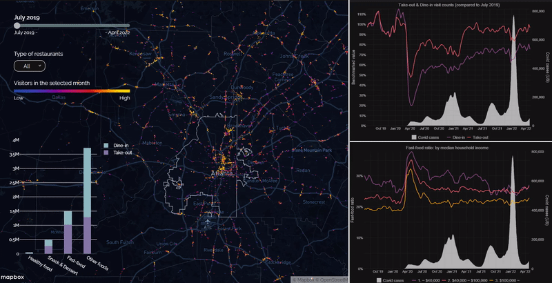

```{r setup, include = FALSE}
library(knitr)
library(tidyverse)
library(gt)
library(kableExtra)
# set default options
opts_chunk$set(echo = FALSE,
               fig.width = 10.252,
               fig.height = 10,
               dpi = 300)

# uncomment the following lines if you want to use the NHS-R theme colours by default
# scale_fill_continuous <- partial(scale_fill_nhs, discrete = FALSE)
# scale_fill_discrete <- partial(scale_fill_nhs, discrete = TRUE)
# scale_colour_continuous <- partial(scale_colour_nhs, discrete = FALSE)
# scale_colour_discrete <- partial(scale_colour_nhs, discrete = TRUE)
```

class: title-slide, left, bottom

# `r rmarkdown::metadata$title`
----
### `r rmarkdown::metadata$author`
### `r rmarkdown::metadata$date`

---
class: inverse, middle, center

## This is one of two required courses to complete 
###(other than the Capstone)
# the Master of Science in Urban Analytics degree

---
# I am

.left-column[
```{r, include=F, out.height='70%'}
knitr::include_graphics("https://ujhwang.github.io/images/IDphoto_Hwang.jpg")
```
# 
]
.right-column[
* <b>Uijeong "UJ" Hwang</b>
* A data analyst in the Transportation Planning Department at the Atlanta Regional Commission.
* Interested in understanding travel behavior and choices, particularly the factors that encourage walking, biking, and public transit use.
* PhD in City and Regional Planning and MS in Urban Analytics.
]


---
#Get-to-Know-You Survey
<div style='position: relative; padding-bottom: 56.25%; padding-top: 35px; height: 0; overflow: hidden;'><iframe sandbox='allow-scripts allow-same-origin allow-presentation' allowfullscreen='true' allowtransparency='true' frameborder='0' height='315' src='https://www.mentimeter.com/app/presentation/alsd15a6faj9rr7p1i5km4n7qvw68xyi/embed' style='position: absolute; top: 0; left: 0; width: 100%; height: 100%;' width='420'></iframe></div>

---

# What is Urban Analytics?

[Urban analytics defined](https://journals.sagepub.com/doi/full/10.1177/2399808319839494)

--

* Application of <b>Big data</b> and <b>data science tools</b> to understand, monitor, and control urban functions and processes

--

* Michael Goodchild defines it as a 'new kind of urban research, one that exploits the vast new sources that are becoming available from <b>social media, crowd sourcing, and sensor networks</b>...'

--

* 'Urban analytics is fast emerging as the core set of tools employed to deal with problems of <b>big data, urban simulation, and geodemographics</b>' -- Michael Batty

--

* Analytics is the <b>discovery, interpretation, and communication of meaningful patterns in data</b>' --Wikipedia


---
#The Plan for the Course

* This course consists of six modules (excluding the prep module)

<table style="font-size: 22px; width: 90%; margin: auto;">
  <tr>
    <th style="text-align: left;">Module</th>
    <th style="text-align: left;">Topic</th>
  </tr>
  <tr>
    <td>Module 0:<br>Preparation</td>
    <td>
      <ul>
        <li>Environment setup: RStudio, Docker, packages...</li>
        <li>Intro to R</li>
      </ul>
    </td>
  </tr>
  <tr>
    <td>Module 1:<br>POI & Census</td>
    <td>
      <ul>
        <li>Using APIs to collect data</li>
        <li>Data wrangling and tidying</li>
      </ul>
    </td>
  </tr>
  <tr>
    <td>Module 2:<br>Graphic communication & <br>storytelling</td>
    <td>
      <ul>
        <li>Interactive visualization</li>
        <li>Telling stories with data / analysis</li>
      </ul>
    </td>
  </tr>
</table>

---
#The Plan for the Course

* This course consists of six modules (excluding the prep module)

<table style="font-size: 22px; width: 90%; margin: auto;">
  <tr>
    <th style="text-align: left;">Module</th>
    <th style="text-align: left;">Topic</th>
  </tr>
  <tr>
    <td>Module 3:<br>Transportation</td>
    <td>
      <ul>
        <li>Using General Transit Feed Specification (GTFS)</li>
        <li>Network analysis with OpenStreetMap</li>
      </ul>
    </td>
  </tr>
  <tr>
    <td>Module 4:<br>Urban image & <br>computer vision</td>
    <td>
      <ul>
        <li>Sampling and processing street view images</li>
        <li>Using Computer Vision to extract information from images</li>
      </ul>
    </td>
  </tr>
  <tr>
    <td>Module 5:<br>Social media</td>
    <td>
      <ul>
        <li>Collecting and processing text data from Reddit</li>
        <li>Sentiment analysis</li>
      </ul>
    </td>
  </tr>
  <tr>
    <td>Module 6:<br>Data ethics</td>
    <td>
      <ul>
        <li>Data ethics and privacy</li>
      </ul>
    </td>
  </tr>
</table>

---
# Deliverables and Grading Breakdown
* Only four out of the five mini assignments will be counted towards the final grade. 
* The team project presentation is based on PowerPoint slides (or other presentation tool of your choice.) 
* The team project report should be a web document rendered from R Markdown (or other tool of your choice).

```{r echo=F}
data.frame('Assignment Type' = c('Mini Assignments (4 out of 5)', 
                                 'Major Assignments (3 out of 3)', 
                                 "Team Project Presentation & Report",
                                 "Participation"),
           'Percent' = c("20% (5% each x 4)", 
                         "45% (15% each x 3)", 
                         "30% (15% each)",
                         "5%")) %>% 
  kbl() %>% 
  kable_styling(bootstrap_options = c("condensed", "responsive"))

```

---
#Course Logistics

###Platform
* RStudio (almost entirely)
* A Docker image will be shared

### Each module consists of
* One or two lecture sessions
* Two lab sessions

### For each lab sessions, you will be given
* One incomplete R Markdown script
* One HTML document generated from the complete R Markdown script

---
#Course Logistics

###Office hour
* Thursday 4:30-6:30pm by appointment
* Online (Google Meet)
* You can find the link in the syllabus

###Communication
* Canvas
* Email: uhwang3@gatech.edu; uhwang@atlantaregional.org

### Readings
* Available via links in the syllabus

---
# Course Logistics

### Assignments
* Render R Markdown script into a web document and publish it to RPubs
* Submit the URL to the web document

### Class presentations 
* Three student presentations (by groups) for final project milestones
* How do you want to form the groups?

## Any questions?


---
# Previous Group Projects

### Fall 2023
* [Tracking Urban Rails-to-trails Discourse on Reddit](https://mohsinyousufi.github.io/cp8883report/)
* [How Do Flood Events Affect Street Networks & Outdoor Activity?](https://rpubs.com/ppatty666/uaprojectfinalv3)
* [Predictive Modeling of the Perception of Liveliness in Atlanta Using Place Pulse and Google Street View Data](https://rpubs.com/runner157/1124596)

### Fall 2024
* [Spatiotemporal Analysis of Imbalanced Parking Demand and Supply](https://thanawit.com/projects/ImbalancedParkingAnalysis/)
* [Analyzing the Impact of Commercial Freight Vehicles on Traffic Safety in Metro Atlanta](https://rpubs.com/jake_mcghee/1250849)
* [How Well Are Cities In Georgia Equipped To Prepare For And Withstand Hurricanes?](https://rpubs.com/klosada/1254375)
* [LEED Certification: The Paradox of Sustainability?](https://rpubs.com/changminseok88/1254221)

---
#Example of MSUA Capstone: Covid-19 & eating habit
<a href="https://ujhwang.github.io/covid-19-eating-habit"></a>


